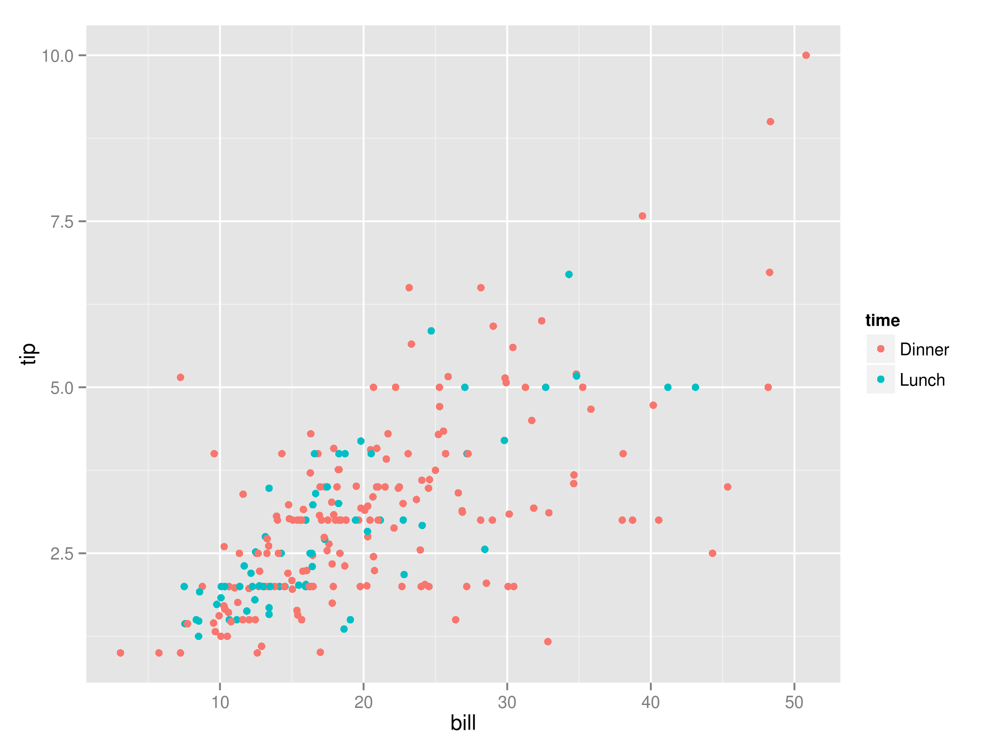

# Exploring Data {#chapter-7-exploring-data}

Now that we have obtained and scrubbed our data, we can continue with the third step of the OSEMN model, which is to explore it. After all that hard work, (unless you already had clean data lying around!), it is time for some fun.

Exploring is the step where you familiarize yourself with the data. Being familiar with the data is essential when you want to extract any value from it. For example, knowing what kind of features the data has, means you know which ones are worth further exploring and which ones you can use to answer any questions that you have.

Exploring your data can be done from three perspectives. The first perspective is to inspect the data and its properties. Here, we want to know, for example, what the raw data looks like, how many data points the data set has, and what kind of features the data set has.

The second perspective from which we can explore out data is to compute descriptive statistics. This perspective is useful for learning more about the individual features. One advantage of this perspective is that the output is often brief and textual and can therefore be printed on the command line.

The third perspective is to create visualizations of the data. From this perspective we can gain insight into how multiple features interact. We’ll discuss a way of creating visualizations that can be printed on the command line. However, visualizations are best suited to be displayed on a graphical user interfaces. An advantage of visualizations over descriptive statistics is that they are more flexible and that they can convey much more information.

## Overview 

In this chapter, you’ll learn how to:

- Inspect the data and its properties.
- Compute descriptive statistics.
- Create data visualizations inside and outside the command line.

## Inspecting Data and its Properties 

In this section we’ll demonstrate how to inspect your data set and its properties. Because the upcoming visualization and modeling techniques expect the data to be in tabular format, we’ll assume that the data is in CSV format. You can use the techniques described in [Chapter 5](#chapter-5-scrubbing-data) to convert your data to CSV if necessary.

For simplicity sake, we’ll also assume that your data has a header. In the first subsection we are going to determine whether that is the case. Once we know we have a header, we can continue answering the following questions:

- How many data points and features does the data set have?
- What does the raw data look like?
- What kind of features does the data set have?
- Can some of these features be treated as categorical or as factors?

### Header Or Not, Here I Come 

You can check whether your file has a header by printing the first few lines:

    $ #? [echo]
    $ head file.csv | csvlook

It is then up to you to decide whether the first line is indeed a header or already the first data point. When the data set contains no header or when its header contains newlines, you’re best off going back to [Chapter 5](#chapter-5-scrubbing-data) and correct that.

### Inspect All The Data 

If you want to inspect the raw data, then it’s best not to use the `cat` command-line tool, since `cat` prints all the data to the screen in one go. In order to inspect the raw data at your own pace, we recommend to use `less` [@less] with the `-S` command-line argument:

    $ #? [echo]
    $ less -S file.csv

The `-S` command-line argument ensures that long lines are not being wrapped when they don’t fit in the terminal. Instead, `less` allows you to scroll horizontally to see the rest of the lines. The advantage of `less` is that it does not load the entire file into memory, which is good for viewing large files. Once you’re in `less`, you can scroll down a full screen by pressing `<Space>`. Scrolling horizontally is done by pressing `<Left>` and `<Right>`. Press `g` and `G` to go to start and the end of the file, respectively. Quiting `less` is done by pressing `q`. Read the man page for more key bindings.

If you want the data set to be nicely formatted, you can add in `csvlook`:

    $ #? [echo]
    $ < file.csv csvlook | less -S

Unfortunately, `csvlook` needs to read the entire file into memory in order to determine the width of the columns. So, when you want to inspect a very large file, then either you may want to get a subset (using `sample`, for example) or you may need to be patient.

### Feature Names and Data Types 

In order to gain insight into the data set, it is useful to print the feature names and study them. After all, the feature names may indicate the meaning of the feature. You can use the following `sed` expression for this:

    $ < data/iris.csv sed -e 's/,/\n/g;q'

Note that this basic command assumes that the file is delimited by commas. Just as reminder: if you intend to use this command often, you could define a function in your *.bashrc* file called, say, *names*:

```{example, name=""}
```
```{bash, eval=FALSE}
names () { sed -e 's/,/\n/g;q'; }
```

Which you can then you use like this:

```{bash, eval=FALSE}
$ < data/investments.csv names
company_permalink
company_name
company_category_list
company_market
company_country_code
company_state_code
company_region
company_city
investor_permalink
investor_name
investor_category_list
investor_market
investor_country_code
investor_state_code
investor_region
investor_city
funding_round_permalink
funding_round_type
funding_round_code
funded_at
funded_month
funded_quarter
funded_year
raised_amount_usd
```

We can go a step further than just printing the column names. Besides the names of the columns, it would be very useful to know what type of values each column contains. Examples of data types are a string of characters, a numerical value, or a date. Assume that we have the following toy data set:

```{bash, eval=FALSE}
$ < data/datatypes.csv csvlook
|-----+--------+-------+----------+------------------+------------+----------|
|  a  | b      | c     | d        | e                | f          | g        |
|-----+--------+-------+----------+------------------+------------+----------|
|  2  | 0.0    | FALSE | "Yes!"   | 2011-11-11 11:00 | 2012-09-08 | 12:34    |
|  42 | 3.1415 | TRUE  | Oh, good | 2014-09-15       | 12/6/70    | 0:07 PM  |
|  66 |        | False | 2198     |                  |            |          |
|-----+--------+-------+----------+------------------+------------+----------|
```

We’ve already used `csvsql` in [Chapter 5](#chapter-5-scrubbing-data) to execute SQL queries directly on CSV data. When no command-line arguments are passed, it generates the necessary SQL statement that would be needed if we were to insert this data into an actual database. We can use the output also for ourselves to inspect what the inferred column types are:

```{bash, eval=FALSE}
csvsql data/datatypes.csv
CREATE TABLE datatypes (
        a INTEGER NOT NULL,
        b FLOAT,
        c BOOLEAN NOT NULL,
        d VARCHAR(8) NOT NULL,
        e DATETIME,
        f DATE,
        g TIME,
        CHECK (c IN (0, 1))
);
```

provides on overview of what the various SQL data types mean. If a column has the *NOT NULL* string printed after the data type, then that column contains no missing values.

+-----------------------+-----------------------+-----------------------+
| Type                  | Python                | SQL                   |
+=======================+=======================+=======================+
| Character string      | unicode               | VARCHAR               |
+-----------------------+-----------------------+-----------------------+
| Boolean               | bool                  | BOOLEAN               |
+-----------------------+-----------------------+-----------------------+
| Integer               | int                   | INTEGER               |
+-----------------------+-----------------------+-----------------------+
| Real number           | float                 | FLOAT                 |
+-----------------------+-----------------------+-----------------------+
| Date                  | datetime.date         | DATE                  |
+-----------------------+-----------------------+-----------------------+
| Time                  | datetime.time         | TIME                  |
+-----------------------+-----------------------+-----------------------+
| Date and time         | datetime.datetime     | DATETIME              |
+-----------------------+-----------------------+-----------------------+

: Python versus SQL data types

### Unique Identifiers, Continuous Variables, and Factors 

Knowing the data type of each feature is not enough. It is also essential to know what each feature represents. Having knowledge about the domain is very useful here, however we may also get some ideas from the data itself.

Both a string and an integer could be a unique identifier or could represent a category. In the latter case, this could be used to assign a color to your visualization. If an integer denotes, say, the ZIP Code, then it doesn’t make sense to compute the average.

To determine whether a feature should be treated as a unique identifier or categorical variable (or factor in R terms), you could count the number of unique values for a specific column:

```{bash, eval=FALSE}
$ cat data/iris.csv | csvcut -c species | body "sort | uniq | wc -l"
species
3
```

Or we can use `csvstat` [@csvstat], which is part of `csvkit`, to get the number of unique values for each column:

```{bash, eval=FALSE}
$ csvstat data/investments2.csv --unique
  1. company_permalink: 27342
  2. company_name: 27324
  3. company_category_list: 8759
  4. company_market: 443
  5. company_country_code: 150
  6. company_state_code: 147
  7. company_region: 1079
  8. company_city: 3305
  9. investor_permalink: 11176
 10. investor_name: 11135
 11. investor_category_list: 468
 12. investor_market: 134
 13. investor_country_code: 111
 14. investor_state_code: 80
 15. investor_region: 549
 16. investor_city: 1198
 17. funding_round_permalink: 41790
 18. funding_round_type: 13
 19. funding_round_code: 15
 20. funded_at: 3595
 21. funded_month: 295
 22. funded_quarter: 121
 23. funded_year: 34
 24. raised_amount_usd: 6143
```

If the number of unique values is low compared to the number of rows, then that feature may indeed be treated as a categorical one (such as *funding\_round\_type*). If the number is equal to the number of rows, it may be a unique identifier (such as *company\_permalink*).

## Computing Descriptive Statistics 

### csvstat 

The command-line tool `csvstat` gives a lot of information. For each feature (column), it shows:

- The data type in Python terminology (see Table 7-1 for a comparison between Python and SQL data types).
- Whether it has any missing values (nulls).
- The number of unique values.
- Various descriptive statistics (maximum, minimum, sum, mean, standard deviation, and median) for those features for which it is appropriate.

We invoke `csvstat` as follows:

```{bash, eval=FALSE}
$ csvstat data/datatypes.csv
  1. a
        <type 'int'>
        Nulls: False
        Values: 2, 66, 42
  2. b
        <type 'float'>
        Nulls: True
        Values: 0.0, 3.1415
  3. c
        <type 'bool'>
        Nulls: False
        Unique values: 2
        5 most frequent values:
                False:  2
                True:   1
  4. d
        <type 'unicode'>
        Nulls: False
        Values: 2198, "Yes!", Oh, good
  5. e
        <type 'datetime.datetime'>
        Nulls: True
        Values: 2011-11-11 11:00:00, 2014-09-15 00:00:00
  6. f
        <type 'datetime.date'>
        Nulls: True
        Values: 2012-09-08, 1970-12-06
  7. g
        <type 'datetime.time'>
        Nulls: True
        Values: 12:34:00, 12:07:00

Row count: 3
```

This gives a very verbose output. For a more concise output specify one of the statistics arguments:

- `--max` (maximum)
- `--min` (minimum)
- `--sum` (sum)
- `--mean` (mean)
- `--median` (median)
- `--stdev` (standard deviation)

- `--nulls` (whether column contains nulls)
- `--unique` (unique values)
- `--freq` (frequent values)
- `--len` (max value length)

For example:

```{bash, eval=FALSE}
$ csvstat data/datatypes.csv --null
  1. a: False
  2. b: True
  3. c: False
  4. d: False
  5. e: True
  6. f: True
  7. g: True
```

You can select a subset of features with the `-c` command-line argument. This accepts both integers and column names:

```{bash, eval=FALSE}
$ csvstat data/investments2.csv -c 2,13,19,24
  2. company_name
        <type 'unicode'>
        Nulls: True
        Unique values: 27324
        5 most frequent values:
                Aviir:  13
                Galectin Therapeutics:  12
                Rostima:        12
                Facebook:       11
                Lending Club:   11
        Max length: 66
 13. investor_country_code
        <type 'unicode'>
        Nulls: True
        Unique values: 111
        5 most frequent values:
                USA:    20806
                GBR:    2357
                DEU:    946
                CAN:    893
                FRA:    737
        Max length: 15
 19. funding_round_code
        <type 'unicode'>
        Nulls: True
        Unique values: 15
        5 most frequent values:
                a:      7529
                b:      4776
                c:      2452
                d:      1042
                e:      384
        Max length: 10
 24. raised_amount_usd
        <type 'int'>
        Nulls: True
        Min: 0
        Max: 3200000000
        Sum: 359891203117
        Mean: 10370010.1748
        Median: 3250000
        Standard Deviation: 38513119.1802
        Unique values: 6143
        5 most frequent values:
                10000000:       1159
                1000000:        1074
                5000000:        1066
                2000000:        875
                3000000:        820

Row count: 41799
```

Please note that `csvstat`, just like `csvsql`, employs heuristics to determine the data type, and therefore may not always get it right. We encourage you to always do a manual inspection as discussed in the previous subsection. Moreover, the type may be a character string or integer that doesn’t say anything about how it should be used.

As a nice extra, `csvstat` outputs, at the very end, the number of data points (rows). Newlines and commas inside values are handles correctly. To only see the relevant line, we can use `tail`:

    $ csvstat data/iris.csv | tail -n 1

If you only want to see the actual number number of data points, you can use, for example, the following `sed` expression to extract the number:

    $ csvstat data/iris.csv | sed -rne '${s/^([^:]+): ([0-9]+)$/\2/;p}'

### Using R from the Command Line using Rio 

In this section we would like to introduce you to a command-line tool called `Rio`, which is essentially a small, nifty wrapper around the statistical programming environment R. Before we explain what Rio does and why it exists, lets talk a bit about R itself.

R is a very powerful statistical software package to analyze data and create visualizations. It’s an interpreted programming language, has an extensive collection of packages, and offers its own REPL (Read-Eval-Print-Loop), which allows you, similar to the command line, to play with your data. Unfortunately, R is quite separated from the command line. Once you start it, you’re in a separate environment. R doesn’t really play well with the command line because you cannot pipe any data into it and it also doesn’t support any one-liners that you can specify.

For example, imagine that you have a CSV file called *tips.csv*, and you would like compute the tip percentage, and save the result. To accomplish this in R you would first startup R:

    $ #? [echo]
    $ R

And then run the following commands:

```r
> tips <- read.csv('tips.csv', header = T, sep = ',', stringsAsFactors = F)
> tips.percent <- tips$tip / tips$bill * 100
> cat(tips.percent, sep = '\n', file = 'percent.csv')
> q("no")
```

Afterwards, you can continue with the saved file *percent.csv* on the command line. Note that there is only one command that is associated with what we want to accomplish specifically. The other commands are necessary boilerplate. Typing in this boilerplate in order to accomplish something simple is cumbersome and breaks your workflow. Sometimes, you only want to do one or two things at a time to your data. Wouldn’t it be great if we could harness the power of R and be able to use it from the command line?

This is where `Rio` comes in. The name Rio stands for *R input/output*, because it enables you to use R as a filter on the command line. You simply pipe CSV data into `Rio` and you specify the R commands that you want to run on it. Let’s perform the same task as before, but now using `Rio`:

    $ < data/tips.csv Rio -e 'df$tip / df$bill * 100' | head -n 10

`Rio` can execute multiple R command that are separated by semicolons. So, if you wanted to add a column called *percent* to the input data, you could do the following:

    $ < data/tips.csv Rio -e 'df$percent <- df$tip / df$bill * 100; df' | head

These small one-liners are possible because `Rio` takes care of all the boilerplate. Being able to use the command line for this and capture the power of R into a one-liner is fantastic, especially if you want to keep on working on the command line. `Rio` assumes that the input data is in CSV format with a header. (By specifying the `-n` command-line argument `Rio` does not consider the first row to be the header and creates default column names.) Behind the scenes, `Rio` writes the piped data to a temporary CSV file and creates a script that:

- Import required libraries.
- Loads the CSV file as a data frame.
- Generates a `ggplot2` object if needed (more on this in the next section).
- Runs the specified commands.

- Prints the result of the last command to standard output.

So now, if you wanted to do one or two things to your data set with R, you can specify it as a one-liner, and keep on working on the command line. All the knowledge that you already have about R can now be used from the command line. With `Rio`, you can even create sophisticated visualizations, as you will see later in this chapter.

Rio doesn’t have to be used as a filter, meaning the output doesn’t have to be a in CSV format per se. You can compute

    $ < data/iris.csv Rio -e 'mean(df$sepal_length)'
    $ < data/iris.csv Rio -e 'sd(df$sepal_length)'
    $ < data/iris.csv Rio -e 'sum(df$sepal_length)'

If we wanted to compute the five summary statistics, we would do:

```{bash, eval=FALSE}
$ < iris.csv Rio -e 'summary(df$sepal_length)'
   Min. 1st Qu.  Median    Mean 3rd Qu.    Max.
  4.300   5.100   5.800   5.843   6.400   7.900
```

You can also compute the skewness (symmetry of the distribution) and kurtosis (peakedness of the distribution), but then you need to have the `moments` package installed:

    $ #? [echo]
    $ < data/iris.csv Rio -e 'skewness(df$sepal_length)'
    $ < data/iris.csv Rio -e 'kurtosis(df$petal_width)'

Correlation between two features:

```{bash, eval=FALSE}
$ < tips.csv Rio -e 'cor(df$bill, df$tip)'
0.6757341
```

Or a correlation matrix:

```{bash, eval=FALSE}
$ < data/tips.csv csvcut -c bill,tip | Rio -f cor | csvlook
|--------------------+--------------------|
|  bill              | tip                |
|--------------------+--------------------|
|  1                 | 0.675734109211365  |
|  0.675734109211365 | 1                  |
|--------------------+--------------------|
```

Note that with the command-line argument `-f`, we can specify the function to apply to the data frame `df`. In this case, it is the same as `-e cor(df)`.

You can even create a stem plot [@Tukey1977] using `Rio`:

    $ < data/iris.csv Rio -e 'stem(df$sepal_length)'

## Creating Visualizations 

In this section we’re going to discuss how to create visualizations at the command line. We’ll be looking at two different software packages: gnuplot and ggplot. First, we’ll introduce both packages. Then, we’ll demonstrate how to create several different types of visualizations using both of them.

### Introducing Gnuplot and Feedgnuplot 

The first software package to create visualizations that we’re discussing in this chapter is Gnuplot. Gnuplot has been around since 1986. Despite being rather old, its visualization capabilities are quite extensive. As such, it’s impossible to do it justice. There are other good resources available, including *Gnuplot in Action* by @Janert2009.

To demonstrate the flexibility (and its archaic notation), consider Example \@ref(exm:script-gnuplot), which is copied from the Gnuplot website (<http://gnuplot.sourceforge.net/demo/histograms.6.gnu>).

```{example script-gnuplot, name="Creating a histogram using Gnuplot"}
```
```
# set terminal pngcairo  transparent enhanced font "arial,10" fontscale 1.0 size
# set output 'histograms.6.png'
set border 3 front linetype -1 linewidth 1.000
set boxwidth 0.75 absolute
set style fill   solid 1.00 border lt -1
set grid nopolar
set grid noxtics nomxtics ytics nomytics noztics nomztics \
 nox2tics nomx2tics noy2tics nomy2tics nocbtics nomcbtics
set grid layerdefault   linetype 0 linewidth 1.000,  linetype 0 linewidth 1.000
set key outside right top vertical Left reverse noenhanced autotitles columnhead
set style histogram columnstacked title  offset character 0, 0, 0
set datafile missing '-'
set style data histograms
set xtics border in scale 1,0.5 nomirror norotate  offset character 0, 0, 0 auto
set xtics  norangelimit
set xtics   ()
set ytics border in scale 0,0 mirror norotate  offset character 0, 0, 0 autojust
set ztics border in scale 0,0 nomirror norotate  offset character 0, 0, 0 autoju
set cbtics border in scale 0,0 mirror norotate  offset character 0, 0, 0 autojus
set rtics axis in scale 0,0 nomirror norotate  offset character 0, 0, 0 autojust
set title "Immigration from Northern Europe\n(columstacked histogram)"
set xlabel "Country of Origin"
set ylabel "Immigration by decade"
set yrange [ 0.00000 : * ] noreverse nowriteback
i = 23
plot 'immigration.dat' using 6 ti col, '' using 12 ti col,      '' using 13 ti c
```

Please note that this is trimmed to 80 characters wide. The above script generates the following image:

```{r, echo=FALSE, fig.cap="Immigration Plot by Gnuplot", fig.align="center"}
knitr::include_graphics("images/histograms.6.png")
```

Gnuplot is different from most command-line tools we’ve been using for two reasons. First, it uses a script instead of command-line arguments. Second, the output is always written to a file and not printed to standard output.

One great advantage of Gnuplot being around for so long, and the main reason we’ve included it in this book, is that it’s able to produce visualizations **for** the command line. That is, it’s able to print its output to the terminal without the need for a graphical user interface (GUI). Even then, you would need to set up a script.

Luckily, there is a command-line tool called `feedgnuplot` [@feedgnuplot], which can help us with setting up a script for Gnuplot. `feedgnuplot` is entirely configurable through command-line arguments. Plus, it reads from standard input. After we have introduced `ggplot2`, we’re going to create a few visualizations using `feedgnuplot`.

One great feature of `feedgnuplot` that we would like to mention here, is that it allows you to plot streaming data. The following is a snapshot of a continuously updated plot based on random input data:

```{bash, eval=FALSE}
$ while true; do echo $RANDOM; done | sample -d 10 | feedgnuplot --stream \
> --terminal 'dumb 80,25' --lines --xlen 10

  30000 ++-----+------------+-------------+-------------+------------+-----++
        |      +            *             +             +            +      |
        |      :            **            :             *******      :      *
  25000 ++.................*.*..........................*.....*............+*
        |      :           *: *           :            *:      *     :     *|
        |      :           *: *           :            *:      *     :     *|
        |      :          * :  *          :           * :       *    :    * |
  20000 ++................*....*......................*.........*.........*++
        |      :          * :   *         :          *  :       *    :    * |
        |      :         *  :   *         :          *  :        *   :   *  |
  15000 ++....**.........*.......*..................*............*.......*.++
        | **** :*        *  :    *        :         *   :         *  :   *  |
        **     :*        *  :     *      ****      *    :         *  :  *   |
  10000 ++.......*......*.........*....**....*.....*..............*.....*..++
        |      :  *     *   :      * **   :   *   *     :          * : *    |
        |      :   *    *   :      **     :    ** *     :          * : *    |
        |      :   *   *    :             :      *      :          * : *    |
   5000 ++..........*..*.........................*..................*.*....++
        |      :     * *    :             :             :           *:*     |
        |      +     **     +             +             +            *      |
      0 ++-----+------*-----+-------------+-------------+------------*-----++
              2350         2352          2354          2356         2358
```

### Introducing ggplot2 

A more modern software package for creating visualizations is ggplot, which is an implementation of the grammar of graphics in R [@Wickham2009].

Thanks to the grammar of graphics and using sensible defaults, `ggplot2` commands tend to be very short and expressive. When used through `Rio`, this is a very convenient way of creating visualizations from the command line.

To demonstrate it’s expressiveness, we’ll recreate the histogram plot generated above by gnuplot, with the help of `Rio`. Because `Rio` expects the data set to be comma-delimited, and because `ggplot2` expects the data in *long* format, we first need to scrub and transform the data a little bit:

```{bash, eval=FALSE}
$ < data/immigration.dat sed -re '/^#/d;s/\t/,/g;s/,-,/,0,/g;s/Region/'\
> 'Period/' | tee data/immigration.csv | head | cut -c1-80
Period,Austria,Hungary,Belgium,Czechoslovakia,Denmark,France,Germany,Greece,Irel
1891-1900,234081,181288,18167,0,50231,30770,505152,15979,388416,651893,26758,950
1901-1910,668209,808511,41635,0,65285,73379,341498,167519,339065,2045877,48262,1
1911-1920,453649,442693,33746,3426,41983,61897,143945,184201,146181,1109524,4371
1921-1930,32868,30680,15846,102194,32430,49610,412202,51084,211234,455315,26948,
1931-1940,3563,7861,4817,14393,2559,12623,144058,9119,10973,68028,7150,4740,3960
1941-1950,24860,3469,12189,8347,5393,38809,226578,8973,19789,57661,14860,10100,1
1951-1960,67106,36637,18575,918,10984,51121,477765,47608,43362,185491,52277,2293
1961-1970,20621,5401,9192,3273,9201,45237,190796,85969,32966,214111,30606,15484,
```

The `sed` expression consists of four parts, delimited by semicolons:

1.  Remove lines that start with *\#*.

2.  Convert tabs to commas.

3.  Change dashes (missing values) into zero’s.

4.  Change the feature name *Region* into *Period*.

We then select only the columns that matter using `csvcut` and subsequently convert the data from a wide format to a long one using the `Rio` and the `melt` function which part of the R package `reshape2`:

```{bash, eval=FALSE}
$ < data/immigration.csv csvcut -c Period,Denmark,Netherlands,Norway,\
> Sweden | Rio -re 'melt(df, id="Period", variable.name="Country", '\
> 'value.name="Count")' | tee data/immigration-long.csv | head | csvlook
|------------+-------------+--------|
|  Period    | Country     | Count  |
|------------+-------------+--------|
|  1891-1900 | Denmark     | 50231  |
|  1901-1910 | Denmark     | 65285  |
|  1911-1920 | Denmark     | 41983  |
|  1921-1930 | Denmark     | 32430  |
|  1931-1940 | Denmark     | 2559   |
|  1941-1950 | Denmark     | 5393   |
|  1951-1960 | Denmark     | 10984  |
|  1961-1970 | Denmark     | 9201   |
|  1891-1900 | Netherlands | 26758  |
|------------+-------------+--------|
```

Now, we can use `Rio` again, but then with an expression that builds up a `ggplot2` visualization:

```{bash, eval=FALSE}
$ < data/immigration-long.csv Rio -ge 'g + geom_bar(aes(Country, Count,'\
> ' fill=Period), stat="identity") + scale_fill_brewer(palette="Set1") '\
> '+ labs(x="Country of origin", y="Immigration by decade", title='\
> '"Immigration from Northern Europe\n(columstacked histogram)")' | display
```

```{r, echo=FALSE, fig.cap="Immigration plot by Rio and ggplot2", fig.align="center"}
knitr::include_graphics("images/rio-immigration.png")
```

The `-g` command-line argument indicates that Rio should load the `ggplot2` package. The output is an image in PNG format. You can either view the PNG image via `display`, which is part of ImageMagick [@display] or you can redirect the output to a PNG file. If you’re on a remote terminal then you probably won’t be able to see any graphics. A workaround for this is to start a webserver from a particular directory:

```{bash, eval=FALSE}
$ python -m SimpleHTTPServer 8000
```

Make sure that you have access to the port (8000 in this case). If you save the PNG image to the directory from which the webserver was launched, then you can access the image from your browser at <http://localhost:8000/file.png>.

### Histograms 

Using `Rio`:

```{bash, eval=FALSE}
$ < data/tips.csv Rio -ge 'g+geom_histogram(aes(bill))' | display
```

```{r, echo=FALSE, fig.cap="Histogram", fig.align="center"}
knitr::include_graphics("images/rio-histogram.png")
```

Using `feedgnuplot`:

```{bash, eval=FALSE}
< data/tips.csv csvcut -c bill | feedgnuplot --terminal 'dumb 80,25' \
--histogram 0 --with boxes --ymin 0 --binwidth 1.5 --unset grid --exit


  25 ++----+------+-----+--***-+-----+------+-----+------+-----+------+----++
     +     +      +     +*** * +     +      +     +      +     +      +     +
     |                   * * *                                              |
     |               *** * * *                                              |
  20 ++              * * * * *                                             ++
     |            **** * * * *                                              |
     |            * ** *** * * ***                                          |
     |            * ** * * * * * *                                          |
  15 ++           * ** * * * * * *                                         ++
     |            * ** * * * * * *                                          |
     |            * ** * * * * * *                                          |
     |            * ** * * * * * * ***                                      |
  10 ++           * ** * * * *** *** *                                     ++
     |            * ** * * * * * * * *                                      |
     |          *** ** * * * * * * * ***** ***                              |
     |          * * ** * * * * * * * * * *** *                              |
   5 ++       *** * ** * * * * * * * * * * * *   ***                       ++
     |        * * * ** * * * * * * * * * * * * *** *                        |
     |        * * * ** * * * * * * * * * * * *** * ********   *** ***       |
     +  ***+*** * * ** *+* * * * * * * * * *+* * *+** * *+* ***+* * * ***   +
   0 ++-***+***********************************************-*****-***-***--++
     0     5      10    15     20    25     30    35     40    45     50    55
```

### Bar Plots 

Using `Rio`:

```{bash, eval=FALSE}
$ < data/tips.csv Rio -ge 'g+geom_bar(aes(factor(size)))' | display
```

```{r, echo=FALSE, fig.cap="Bar Plot", fig.align="center"}
knitr::include_graphics("images/rio-barplot.png")
```

Using `feedgnuplot`:

```{bash, eval=FALSE}
$ < data/tips.csv | csvcut -c size | header -d | feedgnuplot --terminal \
> 'dumb 80,25' --histogram 0  --with boxes --unset grid --exit


  160 ++--------+----***********----+---------+---------+---------+--------++
      +         +    *    +    *    +         +         +         +         +
  140 ++             *         *                                           ++
      |              *         *                                            |
      |              *         *                                            |
  120 ++             *         *                                           ++
      |              *         *                                            |
  100 ++             *         *                                           ++
      |              *         *                                            |
      |              *         *                                            |
   80 ++             *         *                                           ++
      |              *         *                                            |
   60 ++             *         *                                           ++
      |              *         *                                            |
      |              *         *                                            |
   40 ++             *         *********************                       ++
      |              *         *         *         *                        |
   20 ++             *         *         *         *                       ++
      |              *         *         *         *                        |
      +    ***********    +    *    +    *    +    *********************    +
    0 ++---*************************************************************---++
      0         1         2         3         4         5         6         7
```

### Density Plots 

Using `Rio`:

```{bash, eval=FALSE}
$ < data/tips.csv Rio -ge 'g+geom_density(aes(tip / bill * 100, fill=sex), '\
> 'alpha=0.3) + xlab("percent")' | display
```

```{r, echo=FALSE, fig.cap="Density Plot", fig.align="center"}
knitr::include_graphics("images/rio-densityplot.png")
```

Since `feedgnuplot` cannot generate density plots, it’s best to just generate a histogram.

### Box Plots 

Using `Rio`:

```{bash, eval=FALSE}
$ < data/tips.csv Rio -ge 'g+geom_boxplot(aes(time, bill))' | display
```

```{r, echo=FALSE, fig.cap="Box Plot", fig.align="center"}
knitr::include_graphics("images/rio-boxplot.png")
```

Drawing a box plot is unfortunately not possible with `feedgnuplot`.

### Scatter Plots 

Using `Rio`:

```{bash, eval=FALSE}
$ < data/tips.csv Rio -ge 'g+geom_point(aes(bill, tip, color=time))' | display
```

```{r, echo=FALSE, fig.cap="Scatter Plot", fig.align="center"}

```

Using `feedgnuplot`:

```{bash, eval=FALSE}
< data/tips.csv csvcut -c bill,tip | tr , ' ' | header -d | feedgnuplot \
--terminal 'dumb 80,25' --points --domain --unset grid --exit --style 'pt' '14'


  10 ++----+------+-----+------+-----+------+-----+------+-----+------+A---++
     +     +      +     +      +     +      +     +      +     +      +     +
   9 ++                                                            A       ++
     |                                                                      |
   8 ++                                                                    ++
     |                                                  A                   |
     |                                                                      |
   7 ++                                          A                 A       ++
     |                             A     A                                  |
   6 ++                              A    A    A                           ++
     |                             A        A                               |
   5 ++       A                 A A   A A   AA A  AA      A  A     A       ++
     |                                A       A    A     A                  |
   4 ++          A     A  AAAA AAA A  A A  A          A                    ++
     |                A   AAAAA AAA AA            A             A           |
     |              A  AAAAAAA AA A A  AA   A AA                            |
   3 ++           A   AAAAAAAAAAA A A    AA           AA A                 ++
     |              AAAAAAA AA  A A A     A                   A             |
   2 ++        AA AAAAAAAAA A  A  A AA  A A A                              ++
     +     +   AAAAAAAA +A   AA+     + A    +     +      +     +      +     +
   1 ++--A-+A-A---+--AA-+--A---+-----+------+--A--+------+-----+------+----++
     0     5      10    15     20    25     30    35     40    45     50    55
```

### Line Graphs 

```{bash, eval=FALSE}
$ < data/immigration-long.csv Rio -ge 'g+geom_line(aes(x=Period, '\
> 'y=Count, group=Country, color=Country)) + theme(axis.text.x = '\
> 'element_text(angle = -45, hjust = 0))' | display
```

```{r, echo=FALSE, fig.cap="Line Graph", fig.align="center"}
knitr::include_graphics("images/rio-linegraph.png")
```

```{bash, eval=FALSE}
$ < data/immigration.csv | csvcut -c Period,Denmark,Netherlands,Norway,Sweden |
> header -d | tr , ' ' | feedgnuplot --terminal 'dumb 80,25' --lines \
> --autolegend --domain --legend 0 "Denmark" --legend 1 "Netherlands" \
> --legend 2 "Norway" --legend 3 "Sweden" --xlabel "Period" --unset grid --exit


  250000 ++-----%%%-------+-------+--------+-------+-------+--------+------++
         +  %%%% + %      +       +        +       +       + Denmark+****** +
         |%%        %                                    Netherlands ###### |
         |          %                                         Norway $$$$$$ |
  200000 ++          %                                        Sweden %%%%%%++
         |        $   %                                                     |
         |       $ $   %                                                    |
         |      $   $  %                                                    |
  150000 ++   $$     $  %                                                  ++
         |   $        $  %                                                  |
         |  $          $  %                                                 |
  100000 ++$            $ %                                                ++
         |$              $ %%%%%%%%%%                                       |
         |                $          %                                      |
         |    ***********  $$$$$$$$$$$%                                     |
   50000 +****  #########**           $%%                  #######         ++
         |  ####           ********    $$%              ###       ##        |
         |##                       ******##           ##$$$$$$$$$$$$#       |
         +       +        +       +      **###########$$*************       +
       0 ++------+--------+-------+--------*************---+--------+------++
        1890    1900     1910    1920     1930    1940    1950     1960    1970
                                       Period
```

### Summary 

Both `Rio` with `ggplot2` and `feedgnuplot` with Gnuplot have their advantages. The plots generated by `Rio` are obviously of much higher quality. It offers a consistent syntax that lends itself well for the command line. The only down-side would be that the output is not viewable from the command line. This is where `feedgnuplot` may come in handy. Each plot has roughly the same command-line arguments. As such, it would be straightforward to create a small Bash script that would make generating plots from and for the command line even easier. After all, with the command line having such a low resolution, we don’t need a lot of flexibility.

## Further Reading 

* Wickham, Hadley. 2009. <em>ggplot2: Elegant Graphics for Data Analysis</em>. Springer.
* Janert, Philipp K. 2009. <em>Gnuplot in Action</em>. Manning Publications.
* Tukey, John W. 1977. <em>Exploratory Data Analysis</em>. Pearson.
 
