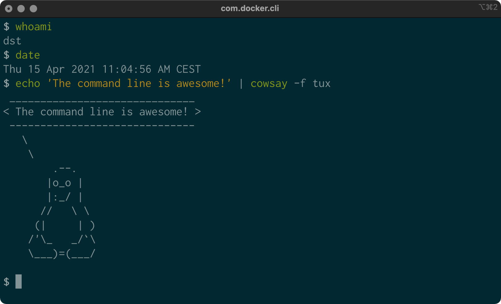

```{r setup, include=FALSE}
library(knitractive)
library(rexpect)

engine <- start(name = "console",
                command = cmd_docker(image = "datasciencetoolbox/dsatcl2e"),
                prompt = prompts$bash,
                session_width = 80,
                session_height = 16)
```

```{console, include = FALSE}
PS1='$ '
```


# Introduction {#chapter-1-introduction}

This book is about doing data science at the command line. Our aim is to make you a more efficient and productive data scientist by teaching you how to leverage the power of the command line.

Having both the terms *data science* and *command line* in the title requires an explanation. How can a technology that is over 50 years old[^1] be of any use to a field that is only a few years young?

Today, data scientists can choose from an overwhelming collection of exciting technologies and programming languages. Python, R, Hadoop, Julia, Pig, Hive, and Spark are but a few examples. You may already have experience in one or more of these. If so, then why should you still care about the command line for doing data science? What does the command line have to offer that these other technologies and programming languages do not?

These are all valid questions. In this first chapter I will answer these questions as follows. First, I provide a practical definition of data science that will act as the backbone of this book. Second, I'll list five important advantages of the command line. Third, I demonstrate the power and flexibility of the command line through a real-world use case. By the end of this chapter I hope to have convinced you that the command line is indeed worth learning for doing data science.

## Overview

In this chapter, you’ll learn:

- A practical definition of data science
- What the command line is exactly and how you can use it
- Why the command line is a wonderful environment for doing data science

## Data Science is OSEMN

The field of data science is still in its infancy, and as such, there exist various definitions of what it encompasses. Throughout this book I employ a very practical definition by @Mason2010. They define data science according to the following five steps: (1) obtaining data, (2) scrubbing data, (3) exploring data, (4) modeling data, and (5) interpreting data. Together, these steps form the OSEMN model (which is pronounced as *awesome*). This definition serves as the backbone of this book because each step, (except step 5, interpreting data, which I explain below) has its own chapter. Below I explain what each step entails.

```{block2, type="rmdcomment"}
Although the five steps are discussed in a linear and incremental fashion, in practice it is very common to move back and forth between them or to perform multiple steps at the same time. Doing data science is an iterative and non-linear process. For example, once you have modeled your data, and you look at the results, you may decide to go back to the scrubbing step to the adjust the features of the data set.
```

### Obtaining Data

Without any data, there is little data science you can do. So the first step is the obtain data. Unless you are fortunate enough to already possess data, you may need to do one or more of the following:

- Download data from another location (e.g., a webpage or server)
- Query data from a database or API (e.g., MySQL or Twitter)
- Extract data from another file (e.g., an HTML file or spreadsheet)
- Generate data yourself (e.g., reading sensors or taking surveys)

In [Chapter 3](#chapter-3-obtaining-data), I discuss several methods for obtaining data using the command line. The obtained data will most likely be in either text, CSV, JSON of HTML/XML format. The next step is to scrub this data.

### Scrubbing Data

It is not uncommon that the obtained data has missing values, inconsistencies, errors, weird characters, or uninteresting columns. In that case, you have to *scrub*, or clean, the data before you can do anything interesting with it. Common scrubbing operations include:

- Filtering lines
- Extracting certain columns
- Replacing values
- Extracting words
- Handling missing values
- Converting data from one format to another

While we data scientists love to create exciting data visualizations and insightful models (steps 3 and 4), usually much effort goes into obtaining and scrubbing the required data first (steps 1 and 2). In *Data Jujitsu*, @Patil2012 states that "80% of the work in any data project is in cleaning the data". In [Chapter 5](#chapter-5-scrubbing-data), I demonstrate how the command line can help accomplish such data scrubbing operations.

### Exploring Data

Once you have scrubbed your data, you are ready to explore it. This is where it gets interesting because here you will get really into your data. In [Chapter 7](#chapter-7-exploring-data) I show you how the command line can be used to:

- Look at your data
- Derive statistics from your data
- Create interesting visualizations

Command-line tools introduced in [Chapter 7](#chapter-7-exploring-data) include: `csvstat` [@csvstat], `feedgnuplot` [@feedgnuplot], and `Rio` [@Rio].

### Modeling Data

If you want to explain the data or predict what will happen, you probably want to create a statistical model of your data. Techniques to create a model include clustering, classification, regression, and dimensionality reduction. The command line is not suitable for implementing a new model from scratch. It is, however, very useful to be able to build a model from the command line. In [Chapter 9](#chapter-9-modeling-data) I will introduce several command-line tools that either build a model locally or employ an API to perform the computation in the cloud.

### Interpreting Data

The final and perhaps most important step in the OSEMN model is interpreting data. This step involves:

- Drawing conclusions from your data
- Evaluating what your results mean
- Communicating your result

To be honest, the computer is of little use here, and the command line does not really come into play at this stage. Once you have reached this step, it is up to you. This is the only step in the OSEMN model which does not have its own chapter. Instead, I kindly refer you to *Thinking with Data* by @Shron2014.

## Intermezzo Chapters

Besides the chapters that cover the OSEMN steps, there are four intermezzo chapters. Each intermezzo chapter discusses a more general topic concerning data science, and how the command line is employed for that. These topics are applicable to any step in the data science process.

In [Chapter 4](#chapter-4-creating-reusable-command-line-tools), I discuss how to create reusable tools for the command line. These personal tools can come from both long commands that you have typed on the command line, or from existing code that you have written in, say, Python or R. Being able to create your own tools allows you to become more efficient and productive.

Because the command line is an interactive environment for doing data science, it can become challenging to keep track of your workflow. In [Chapter 6](#chapter-6-managing-your-data-workflow), I demonstrate a command-line tool called Drake [@drake], which allows you to define your data science workflow in terms of tasks and the dependencies between them. This tool increases the reproducibility of your workflow, not only for you but also for your colleagues and peers.

In [Chapter 8](#chapter-8-parallel-processing), I explain how your commands and tools can be sped up by running them in parallel. Using a command-line tool called GNU Parallel [@parallel], we can apply command-line tools to very large data sets and run them on multiple cores and remote machines.

In [Chapter 10](#chapter-10-polyglot-data-science), I discuss how to employ the power of the command line in other environments and programming languages such as R, Jupyter Notebooks, Julia, and even Apache Spark.


## What is the Command Line?

Before I discuss *why* you should use the command line for data science, let's take a peek at *what* the command line actually looks like (it may be already familiar to you). \@ref(fig:mac-terminal) and \@ref(fig:ubuntu-terminal) show a screenshot of the command line as it appears by default on macOS and Ubuntu, respectively. Ubuntu is a particular distribution of GNU/Linux, which I’ll be assuming throughout the book.

```{r mac-terminal, echo=FALSE, fig.cap="Command line on macOS", fig.align="center"}

```

```{r ubuntu-terminal, echo=FALSE, fig.cap="Command line on Ubuntu", fig.align="center"}
knitr::include_graphics("images/screenshot_terminal_ubuntu_dst.png")
```

The window shown in the two screenshots is called the terminal. This is the program that enables you to interact with the shell. It is the shell that executes the commands I type in. (On both Ubuntu and macOS, the default shell is Bash.)

```{block2, type="rmdnote"}
I’m not showing the Microsoft Windows command line (also known as the Command Prompt or PowerShell), because it's fundamentally different and incompatible with the commands presented in this book. The good news is that you can install a Docker image on Microsoft Windows so that you’re able to follow along. How to install the Docker image is explained in [Chapter 2](#chapter-2-getting-started).
```

Typing commands is a very different way of interacting with your computer than through a graphical user interface. If you are mostly used to processing data in, say, Microsoft Excel, then this approach may seem intimidating at first. Don’t be afraid. Trust me when I say that you’ll get used to working at the command line very quickly.

In this book, the commands that we type and the output that they generate, are displayed as text. For example, the contents of the terminal (after the welcome message) in the two screenshots would look like this:

```{console}
whoami
date
echo 'The command line is awesome!' | cowsay -f tux
```

You’ll also notice that each command is preceded with a dollar sign (**$**). This is called the prompt. The prompt in the two screenshots showed more information, namely the username, the date, and a penguin. It’s a convention to show only a dollar sign in examples, because the prompt (1) can change during a session (when you go to a different directory), (2) can be customized by the user (e.g., it can also show the time or the current `git` [@git] branch you’re working on), and (3) is irrelevant for the commands themselves.

In the next chapter I’ll explain much more about essential command-line concepts. Now it’s time to first explain *why* you should learn to use the command line for doing data science.

## Why Data Science at the Command Line?

The command line has many great advantages that can really make you a more efficient and productive data scientist. Roughly grouping the advantages, the command line is: agile, augmenting, scalable, extensible, and ubiquitous. I elaborate on each advantage below.

### The Command Line is Agile

The first advantage of the command line is that it allows you to be agile. Data science has a very interactive and exploratory nature, and the environment that you work in needs to allow for that. The command line achieves this by two means.

First, the command line provides a so-called read-eval-print-loop (REPL). This means that you type in command, press **Enter**, and the command is evaluated immediately. A REPL is often much more convenient for doing data science than the edit-compile-run-debug cycle associated with scripts, large programs, and, say, Hadoop jobs. Your commands are executed immediately, may be stopped at will, and can be changed quickly. This short iteration cycle really allows you to play with your data.

Second, the command line is very close to the file system. Because data is the main ingredient for doing data science, it is important to be able to easily work with the files that contain your data set. The command line offers many convenient tools for this.

### The Command Line is Augmenting


The command line integrates well with other technologies. Whatever technology your data science workflow currently includes (whether it's R, Python, or Excel), please know that I'm not suggesting you abandon that workflow.
Instead, consider the command line as an augmenting technology that amplifies the technologies you’re currently employing. It can do so in three ways.

First, the command line can work with data from various sources, including databases, RESTful APIs, and Microsoft Excel. I cover this in [Chapter 2](#chapter-2-getting-started).

Second, you can often delegate tasks to the command line from your own environment. For example, Python, R, and Spark allow you to run command-line tools and capture their output. I demonstrate this with examples in [Chapter 10](#chapter-10-polyglot-data-science). The command line can act as a glue between many different data science tools.

Third, you can convert your code (e.g., a Python script or R function) into a reusable command-line tool. That way, it doesn't matter anymore in what language it's written. Now, it can be used from the command line directly or from any environment that integrates with the command line as mentioned in the previous paragraph. I explain how to this in [Chapter 4](#chapter-4-creating-reusable-command-line-tools).

In the end, every technology has its strengths and weaknesses, so it’s good to know several and use whichever is most appropriate for the task at hand. Sometimes that means using R, sometimes the command line, and sometimes even pen and paper.
By the end of this book you’ll have a solid understanding of when you could use the command line, and when you’re better off continuing with your favorite programming language or statistical computing environment.


### The Command Line is Scalable

Working on the command line is very different from using a graphical user interface (GUI). On the command line you do things by typing, whereas with a GUI, you do things by pointing and clicking with a mouse.

Everything that you type manually on the command line, can also be automated through scripts and tools. This makes it very easy to re-run your commands in case you made a mistake, when the data set changed, or because your colleague wants to perform the same analysis. Moreover, your commands can be run at specific intervals, on a remote server, and in parallel on many chunks of data (more on that in Chapter 8).

Because the command line is automatable, it becomes scalable and repeatable. It is not straightforward to automate pointing and clicking, which makes a GUI a less suitable environment for doing scalable and repeatable data science.

### The Command Line is Extensible

The command line itself was invented over 50 year ago. Its core functionality has largely remained unchanged, but the *tools*, which are the workhorses of the command-line, are being developed on a daily basis.

The command line itself is language agnostic. This allows the command-line tools to be written in many different programming languages. The open source community is producing many free and high-quality command-line tools that we can use for data science.

These command-line tools can work together, which makes the command line very flexible. You can also create your own tools, allowing you to extending the effective functionality of the command line.

### The Command Line is Ubiquitous

Because the command line comes with any Unix-like operating system, including Ubuntu Linux and macOS, it can be found in many places. According to [an article on Top 500 Supercomputer Sites](http://top500.org/blog/lists/2013/11/press-release), 95% of the top 500 supercomputers are running GNU/Linux. So, if you ever get your hands on one of those supercomputers (or if you ever find yourself in Jurassic Park with the doors locks not working), you better know your way around the command line!

But GNU/Linux not only runs on supercomputers. It also runs on servers, laptops, and embedded systems. These days, many companies offer cloud computing, where you can easily launch new machines on the fly. If you ever log in to such a machine (or a server in general), there’s a good chance that you’ll arrive at the command line.

Besides mentioning that the command line is available in a lot of places, it is also important to note that the command line is not a hype. This technology has been around for more than five decades, and I'm convinced that it's here to stay for another five. Learning how to use the command line (for data science) is therefore a worthwhile investment.

## A Real-world Use Case


In the previous sections, I’ve given you a definition of data science and explained to you why the command line can be a great environment for doing data science. Now it’s time to demonstrate the power and flexibility of the command line through a real-world use case. I'll go pretty fast, so don't worry if some things don't make sense yet.

```{console}
curl -sL 'https://www.openml.org/data/get_csv/21854866/penguins.arff' > penguin.csv
wc -l penguin.csv
head -n 10 penguin.csv
sed -i -re '1s/_(mm|g)//g' penguin.csv
```

```{console}
cat penguin.csv |
xsv sample 15 |
xsv select species,culmen_length,culmen_depth,flipper_length,body_mass |
csvlook
```

In this section we’ve peeked at some important concepts and some exciting command-line tools. Don’t worry if some things don’t make sense yet. Most of the concepts will be discussed in [Chapter 2](#chapter-2-getting-started), and in the subsequent chapters I’ll go into more detail for all the command-line tools used in this section.

## Further Reading

* Mason, Hilary, and Chris H. Wiggins. 2010. “A Taxonomy of Data Science.” <a href="http://www.dataists.com/2010/09/a-taxonomy-of-data-science" class="uri">http://www.dataists.com/2010/09/a-taxonomy-of-data-science</a>.
* Patil, DJ. 2012. <em>Data Jujitsu</em>. O’Reilly Media.
* O'Neil, C. \& Schutt, R. 2013. <em>Doing Data Science</em>. O'Reilly Media.
* Shron, Max. 2014. <em>Thinking with Data</em>. O’Reilly Media.


[^1]: The development of the UNIX operating system started back in 1969. It featured a command line since the beginning. The important concept of pipes, which I will discuss in [Section 2.3](#essential-concepts), was added in 1973.

```{r teardown, include = FALSE}
send_lines(engine$session, "exit")
```
