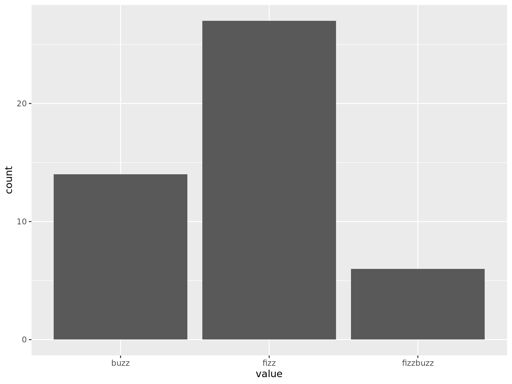

```{r console_start, include=FALSE}
console_start()
```

```{console setup_history, include=FALSE}
 export CHAPTER="05"
 export HISTFILE=/history/history_${CHAPTER}
 rm -f $HISTFILE
```

```{console install_pup_arm64, include=FALSE}
curl -sL https://github.com/ericchiang/pup/releases/download/v0.4.0/pup_v0.4.0_linux_arm64.zip -o pup.zip
unzip pup.zip
sudo mv pup /usr/bin/
rm pup.zip
```

# Scrubbing Data {#chapter-5-scrubbing-data}

Two chapters ago, in the first step of the OSEMN model for data science, we looked at *obtaining* data from a variety of sources.
This chapter is all about the second step: *scrubbing* data.
You see, it's quite rare that you can immediately continue with *exploring* or even *modeling* the data.
There's a plethora of reasons why your data first needs some cleaning, or scrubbing.

For starters, the data might not be in the desired format.
For example, you may have obtained some JSON data from an API, but you need it to be in CSV format to create a visualization.
Other common formats include plain text, HTML, and XML.
Most command-line tools only work with one or two formats, so it's important that you're able to convert data from one format to another.

Once the data is in the desired format, there could still be issues like missing values, inconsistencies, weird characters, or unnecessary parts.
You can fix these by applying filters, replacing values, and combining multiple files.
The command line is especially well-suited for these kind of transformations, because there are many specialized tools available, most of which can handle large amounts of data.
In this chapter I’ll discuss classic tools such as `grep` [@grep] and `awk` [@awk], and newer tools such as `jq` [@jq] and `pup` [@pup].

Sometimes you can use the same command-line tool to perform several operations or multiple tools to perform the same operation.
This chapter is more structured like a cookbook, where the focus is on the problems or recipes, rather than diving deeply into the command-line tools themselves.


## Overview

<!-- #TODO: SHOULD: Review the list below once the chapter is complete -->

In this chapter, you’ll learn how to:

- Convert data from one format to another
- Apply SQL queries directly to CSV
- Filter lines
- Extract and replace values
- Split, merge, and extract columns
- Combine multiple files

This chapter starts with the following files:

```{console list_files}
cd /data/ch05
l
```

The instructions to get these files are in [Chapter 2](#chapter-2-getting-started).
Any other files are either downloaded or generated using command-line tools.

Before I dive into the actual transformations, I'd like to demonstrate their ubiquity when working at the command line.


## Transformations, Transformations Everywhere

In [Chapter 1](#chapter-1-introduction) I mentioned that, in practice, the steps of the OSEMN model will rarely be followed linearly.
In this vein, although scrubbing is the second step of the OSEMN model, I want you to know that it's not *just* the obtained data that needs scrubbing.
The transformations that you'll learn in this chapter can be useful at any part of your pipeline and at any step of the OSEMN model.
Generally, if one command line tool generates output that can be used immediately by the next tool, you can chain the two tools together by using the pipe operator (`|`).
Otherwise, a transformation needs to be applied to the data first by inserting an intermediate tool into the pipeline.

Let me walk you through an example to make this more concrete.
Imagine that you have obtained the first 100 items of a *fizzbuzz* sequence (cf. [Chapter 4](#chapter-4-creating-command-line-tools)) and that you'd like to visualize how often the words *fizz*, *buzz*, and *fizzbuzz* appear using a bar chart.
Don't worry if this example uses tools that you might not be familiar with yet, they'll all be covered in more detail later.

First you obtain the data by generating the sequence and write it to *fb.seq*:

```{console fb_seq, callouts=2}
seq 100 |
/data/ch04/fizzbuzz.py |
tee fb.seq | trim
```
<1> The custom tool `fizzbuzz.py` comes from [Chapter 4](#chapter-4-creating-command-line-tools).

Then you use `grep` to keep the lines that match the pattern *fizz* or *buzz* and count how often each word appears using `sort` and `uniq` [@uniq]:

```{console fb_count}
grep -E "fizz|buzz" fb.seq | # <1>
sort | uniq -c | sort -nr > fb.cnt # <2>
bat -A fb.cnt
```
<1> This regular expression also matches *fizzbuzz*.
<2> Using `sort` and `uniq` this way is a common way to count lines and sort them in descending order. It's the `-c` option that adds the counts.

Note that `sort` is used twice: first because `uniq` assumes its input data to be sorted and second to sort the counts numerically.
In a way, this is an intermediate transformation, albeit a subtle one.

The next step would be to visualize the counts using `rush` [@rush].
However, since `rush` expects the input data to be in CSV format, this requires a less subtle transformation first.
`awk` can add a header, flip the two fields, and insert commas in a single incantation:

```{console fb_awk}
< fb.cnt awk 'BEGIN { print "value,count" } { print $2","$1 }' > fb.csv
bat fb.csv
csvlook fb.csv
```

Now you're ready to use `rush` to create a bar chart.
See \@ref(fig:fb-image) for the result.
(I'll cover this syntax of `rush` in detail in [Chapter 7](#chapter-7-exploring-data).)

```{console fb_rush}
rush plot -x value -y count --geom col --height 2 fb.csv > fb.png
display fb.png
```
```{r fb-image, echo=FALSE, fig.cap="Counting fizz, buzz, and fizzbuzz", fig.align="center", out.width="90%"}

```

Although this example is a bit contrived, it reveals a pattern that is common when working at the command line.
The key tools, such as the ones that obtain data, create a visualization, or train a model, often require intermediate transformations in order to be chained into a pipeline.
In that sense, writing a pipeline is like solving a puzzle, where the key pieces often require helper pieces to fit.

Now that you've seen the importance of scrubbing data, you're ready to learn about some actual transformations.


## Plain Text

Formally speaking, *plain text* refers to a sequence of human-readable characters and optionally, some specific types of control characters such as tabs and newlines[@plaintext].
Examples are logs, e-books, emails, and source code.
Plain text has many benefits over binary data[@pragmaticprogrammer], including:

- It can be opened, edited, and saved using any text editor
- It's self-describing and independent of the application that created it
- It will outlive other forms of data, because no additional knowledge or applications are required to process it

But most importantly, the Unix philosophy considers plain text to be the universal interface between command-line tools[@raymond2003art].
Meaning, most tools accept plain text as input and produce plain text as output.

That's reason enough for me to start with plain text.
The other formats that I discuss in this chapter, CSV, JSON, XML, and HTML are indeed also plain text.
For now, I assume that the plain text has no clear tabular structure (like CSV does) or nested structure (like JSON, XML, and HTML do).
Later in this chapter, I'll introduce some tools that are specifically designed for working with these formats.

<!-- #TODO: SHOULD: What to do with this part? -->
<!-- Although the tools in this section can also be applied to these other formats (because they're still text), -->
<!-- keep in mind that the tools treat the data as plain text, and don't interpret the tabular or nested structure. -->
<!-- Sometimes you can get away with this,  -->


### Filtering Lines

The first scrubbing operation is filtering lines.
This means that from the input data, each line will be evaluated whether it will be kept or discarded.


#### Based on Location

The most straightforward way to filter lines is based on their location.
This may be useful when you want to inspect, say, the top 10 lines of a file, or when you extract a specific row from the output of another command-line tool.
To illustrate how to filter based on location, let’s create a dummy file that contains 10 lines:

```{console}
seq -f "Line %g" 10 | tee lines
```

You can print the first 3 lines using either `head` [@head], `sed` [@sed], or `awk`:

```{console, callouts="NR"}
< lines head -n 3
< lines sed -n '1,3p'
< lines awk 'NR <= 3'
```
<1> In `awk`, *NR* refers to the total number of input records seen so far.

Similarly, you can print the last 3 lines using `tail` [@tail]:

```{console}
< lines tail -n 3
```

You can also you use `sed` and `awk` for this, but `tail` is much faster.
Removing the first 3 lines goes as follows:

```{console}
< lines tail -n +4
< lines sed '1,3d'
< lines sed -n '1,3!p'
```

Notice that with `tail` you have to specify the number of lines plus one.
Think of it as the line from which you want to start printing.
Removing the last 3 lines can be done with `head`:

```{console}
< lines head -n -3
```

You can print specific lines using a either `sed`, `awk`, or a combination of `head` and `tail`.
Here I print lines 4, 5, and 6:

```{console}
< lines sed -n '4,6p'
< lines awk '(NR>=4) && (NR<=6)'
< lines head -n 6 | tail -n 3
```

You can print odd lines with `sed` by specifying a start and a step, or with `awk` by using the modulo operator:

```{console}
< lines sed -n '1~2p'
< lines awk 'NR%2'
```

Printing even lines works in a similar manner:

```{console}
< lines sed -n '0~2p'
< lines awk '(NR+1)%2'
```

<!-- #TODO: SHOULD: Mention somewhere in the book that Linux doesn't care about file extensions -->

```{block2, type="rmdnote"}
Many of these examples start with the smaller-than sign (`<`) followed by the filename.
I do this because this allows me to read the pipeline from left to right.
Please know that this is my own preference.
You can also use `cat` to pipe the contents of a file.
Also, many command-line tools also accept the filename as an argument.
```


#### Based on a Pattern

Sometimes you want to keep or discard lines based on their contents.
With `grep`, the canonical command-line tool for filtering lines, you can print every line that matches a certain pattern or regular expression.
For example, to extract all the chapter headings from *Alice’s Adventures in Wonderland*:

```{console alice_grep, callouts=1}
< alice.txt grep -i chapter
```
<1> The `-i` options specifies that the matching should be case-insensitive.

You can also specify a regular expression.
For example, if you only wanted to print the headings that start with *The*:

```{console}
< alice.txt grep -E '^CHAPTER (.*)\. The'
```

Note that you have to specify the `-E` option in order to enable regular expressions.
Otherwise, `grep` interprets the pattern as a literal string which most likely results in no matches at all:

```{console}
< alice.txt grep '^CHAPTER (.*)\. The'
```

With the `-v` option you invert the matches, so that `grep` prints the lines which *don't* match the pattern.
The regular expression below matches lines that contain white space, only.
So with the inverse, and using `wc -l`, you can count the number of non-empty lines:

```{console}
< alice.txt grep -Ev '^\s$' | wc -l
```


#### Based on Randomness

When you’re in the process of formulating your data pipeline and you have a lot of data, then debugging your pipeline can be cumbersome.
In that case, generating a smaller sample from the data might be useful.
This is where `sample` [@sample] comes in handy.
The main purpose of `sample` is to get a subset of the data by outputting only a certain percentage of the input on a line-by-line basis.


```{console set_random_seed, include=FALSE}
RANDOM=1337
```

```{console}
seq -f "Line %g" 1000 | sample -r 1%
```

Here, every input line has a one percent chance of being printed.
This percentage can also be specified as a fraction (namely `1/100`) or as a probability (namely `0.01`).

`sample` has two other purposes, which can be useful when you’re debugging your pipeline.
First, it’s possible to add some delay to the output.
This comes in handy when the input is a constant stream (for example, the Wikipedia stream we saw in [Chapter 3](#chapter-3-obtaining-data)), and the data comes in too fast to see what’s going on.
Secondly, you can put a timer on `sample`, so that you don’t have to kill the ongoing process manually.
For example, to add a 1 second delay between each line being printed and to only run for 5 seconds, you would type:

```{console callouts="ts"}
seq -f "Line %g" 1000 | sample -r 1% -d 1000 -s 5 | ts
```
<1> The tool `ts`[@ts] adds a timestamp in front of each line.

In order to prevent unnecessary computation, try to put `sample` as early as possible in your pipeline.
In fact, this argument holds for any command-line tool that reduces data, like `head` and `tail`.
Once you’re confident your pipeline works, you take it out of the pipeline.


### Extracting Values

To extract the actual chapter headings from our example earlier, you can take a simple approach by piping the output of `grep` to `cut`:

```{console grep_chapter_cut}
grep -i chapter alice.txt | cut -d ' ' -f 3-
```

Here, each line that’s passed to `cut` is being split on spaces into fields, and then the third field to the last field is being printed.
The total number of fields can be different per input line.
With `sed` you can accomplish the same task in a much more complex manner:

```{console sed_chapter_heading}
sed -rn 's/^CHAPTER ([IVXLCDM]{1,})\. (.*)$/\2/p' alice.txt | trim 3
```

(Since the output is the same it’s trimmed to three lines.) This approach uses a regular expression and a back reference.
Here, `sed` also takes over the work done by `grep`.
I only recommend using such a complicated approach when a simpler one would not work.
For example, if *chapter* was ever part of the text itself and not just used to indicate the start of a new chapter.
Of course there are many levels of complexity which would have worked around this, but this is to illustrate an extremely strict approach.
In practice, the challenge is to come up with a pipeline that strikes a good balance between complexity and flexibility.

It’s worth noting that `cut` can also split on characters positions.
This is useful for when you want to extract (or remove) the same set of characters per input line:

```{console}
grep -i chapter alice.txt | cut -c 9-
```

`grep` has a great feature that outputs every match onto a separate line using the `-o` option:

```{console}
< alice.txt grep -oE '\w{2,}' | trim
```

But what if you wanted to create a dataset of all the words that start with an *a* and end with an *e*?
Well, of course there’s a pipeline for that too:

```{console, callouts=list(1)}
< alice.txt tr '[:upper:]' '[:lower:]' |
grep -oE '\w{2,}' |
grep -E '^a.*e$' |
sort | uniq | sort -nr | trim
```
<1> Here I use `tr` to make the text lowercase. We'll have a closer look at `tr` in the next section.

The two `grep` commands might have been combined into one, but in this case I decided it would be easier to reuse and adapt the previous pipeline.
There's no shame in being pragmatic in order to get the job done!


### Replacing and Deleting Values

You can use the command-line tool `tr` [@tr], which stands for *translate*, to replace or delete individual characters.
For example, spaces can be replaced by underscores as follows:

```{console}
echo 'hello world!' | tr ' ' '_'
```

If more than one character needs to be replaced, then you can combine that:

```{console}
echo 'hello world!' | tr ' !' '_?'
```

`tr` can also be used to delete individual characters by specifying the argument `-d`:

```{console}
echo 'hello world!' | tr -d ' !'
echo 'hello world!' | tr -d -c '[a-z]'
```

In this case, these two commands accomplish the same thing.
The second command, however, uses two additional features:
It specifies a *range* of characters (all lowercase letters) using the square brackets and the dash (`[-]`), and the `-c` option indicates that complement of that should be used.
In other words, this command only keeps lowercase letters.
You can even use `tr` to convert text to uppercase:

```{console}
echo 'hello world!' | tr '[a-z]' '[A-Z]'
echo 'hello world!' | tr '[:lower:]' '[:upper:]'
```

However, if you need to translate non-ASCII characters, then `tr` may not work because it operates on single-byte characters only. In those cases you should use `sed` instead:

```{console}
echo 'hello world!' | tr '[a-z]' '[A-Z]'
echo 'hallo wêreld!' | tr '[a-z]' '[A-Z]'
echo 'hallo wêreld!' | tr '[:lower:]' '[:upper:]'
echo 'hallo wêreld!' | sed 's/[[:lower:]]*/\U&/g'
echo 'helló világ' | tr '[:lower:]' '[:upper:]'
echo 'helló világ' | sed 's/[[:lower:]]*/\U&/g'
```

<!-- #TODO: SHOULD: Give a proper intro about sed -->

If you need to operate on more than individual characters, then you may find `sed` useful.
You've already seen an example of `sed` with extracting the chapter headings from *alice.txt*.
Extracting, deleting, and replacing is actually all the same operation in `sed`.
You just specify different regular expressions.
For example, to change a word, remove repeated spaces, and remove leading spaces:

```{console, callouts=2:4}
echo ' hello     world!' |
sed -re 's/hello/bye/' |
sed -re 's/\s+/ /g' |
sed -re 's/\s+//'
```
<1> Replace *hello* with *bye*.
<2> Replace any whitespace with one space. The flag `g` stands for global, meaning that the same substitution can be applied more than once on the same line.
<3> This only removes leading spaces because I didn't specify the flag `g` here.

Again, just as with the `grep` example earlier, these three `sed` commands can be combined into one:

```{console}
echo ' hello     world!' |
sed -re 's/hello/bye/;s/\s+/ /g;s/\s+//'
```
But tell me, what do you find easier to read?


## CSV


<!-- #TODO: MUST: ### Canonical Format -->

<!-- The `csvkit` documentation[@csvkit] opens with: [...] CSV, the king of tabular file formats. -->

<!-- Canonical format. The format that we want to convert to. -->
<!-- Two properties. it's plain text and it has a rectangular shape, meaning in consists of rows and columns. -->

<!-- As a format, -->

<!-- As a shape, -->

<!-- Even kings have their flaws. -->
<!-- CSV definitely has its flaws. No meta data. No rules regarding quoting, the delimiter, header. -->
<!-- Writing a robust CSV parser is really hard. Nevertheless, CSV has many advantages. -->

<!-- CSV, which is the main format I'll be working with in this chapter, is actually not the easiest format to work with. Many CSV datasets are broken or incompatible with each other because there is no standard syntax, unlike XML and JSON. -->

<!-- Export from Database, spreadsheets, rectangular. -->


<!-- - It's still plain text, so can be read, edited, and even created in any text editor. -->
<!-- - CSV can be imported by many programming languages such as Python, R, and JavaScript and many software such as Excel, Tableau, and Power BI. -->
<!-- - Related to the previous point, but worth mentioning separately: a CSV directly translates to a data frame in Python (with the pandas package), R, and Julia. This means that can immediately continue scrubbing, exploring, and modeling in those languages. -->
<!-- - Speaking of modeling, most machine learning algorithms expect data to be in a rectangular format, or more precisely, a matrix of numerical values where each row is a data point and each column is a feature. More on this in Chapter 9. -->


<!-- makes assumptions, same number of fields per row. -->
<!-- flat. not nested. -->
<!-- CVS is not nested structure -->
<!-- If you build an API, use JSON -->
<!-- If you -->
<!-- You rarely have to covert CSV to anything else when you're doing data analysis. -->


### Bodies and Headers and Columns, Oh My!

The command-line tools that I’ve used to scrub plain text, such as `tr` and `grep`, cannot always be applied to CSV.
The reason is that these command-line tools have no notion of headers, bodies, and columns.
What if you want to filter lines using `grep` but always include the header in the output?
Or what if you only want to uppercase the values of a specific column using `tr` and leave the other columns untouched?

There are multi-step workarounds for this, but they are very cumbersome.
I have something better.
In order to leverage ordinary command-line tools for CSV, I’d like to introduce you to three command-line tools, aptly named: `body` [@body], `header` [@header], and `cols` [@cols].

Let’s start with the first command-line tool, `body`.
With `body` you can apply any command-line tool to the body of a CSV file, that is, everything excluding the header.
For example:

```{console}
echo -e "value\n7\n2\n5\n3" | body sort -n
```

It assumes that the header of the CSV file only spans one row.
It works like this:

- Take one line from standard in and store it as a variable named *\$header*.
- Print out the header.
- Execute all the command-line arguments passed to `body` on the remaining data in standard in.

Here’s another example.
Imagine that you want to count the lines of the following CSV file:

```{console}
seq 5 | header -a count
```

With `wc -l`, you can count the number of all lines:

```{console}
seq 5 | header -a count | wc -l
```

If you only want to consider the lines in the body (so everything except the header), you  add `body`:

```{console}
seq 5 | header -a count | body wc -l
```

Note that the header is not used and is also printed again in the output.

The second command-line tool, `header` allows you to manipulate the header of a CSV file.
If no arguments are provided, the header of the CSV file is printed:

```{console}
< tips.csv header
```

This is the same as `head -n 1`.
If the header spans more than one row, which is not recommended, you can specify `-n 2`.
You can also add a header to a CSV file:

```{console}
seq 5 | header -a count
```

This is equivalent to `echo "count" | cat - <(seq 5)`.
Deleting a header is done with the `-d` option:

```{console}
< iris.csv header -d | trim
```

This is similar to `tail -n +2`, but it’s a bit easier to remember.
Replacing a header, which is basically first deleting a header and then adding one if you look at the above source code, is accomplished by specifying the `-r` option. Here, we combine it with `body`:

```{console}
seq 5 | header -a line | body wc -l | header -r count
```

And last but not least, you can apply a command to just the header, similar to what the `body` command-line tool does to the body.
For example:

```{console}
seq 5 | header -a line | header -e "tr '[a-z]' '[A-Z]'"
```

The third command-line tool is called `cols`, which allows you to apply a certain command to only a subset of the columns.
For example, if you wanted to uppercase the values in the day column in the tips data set (without affecting the other columns and the header), you would use `cols` in combination with `body`, as follows:

```{console}
< tips.csv cols -c day body "tr '[a-z]' '[A-Z]'" | head -n 5 | csvlook
```

Please note that passing multiple command-line tools and arguments as command to `header -e`, `body`, and `cols` can lead to tricky quoting citations.
If you ever run in such problems, it's best to create a separate command-line tool for this and pass that as command.

In conclusion, while it is generally preferable to use command-line tools which are specifically made for CSV data, `body`, `header`, and `cols` also allow you to apply the classic command-line tools to CSV files if needed.


### Performing SQL Queries on CSV

In case the command-line tools mentioned in this chapter do not provide enough flexibility, then there is another approach to scrub your data from the command line.
The tool `csvsql` [@csvsql] allows you to execute SQL queries directly on CSV files.
SQL is a powerful language to define operations for scrubbing data; it's a very different way than using individual command-line tools.

```{block2, type="rmdnote"}
If your data originally comes from a relational database, then, if possible, try to execute SQL queries on that database and subsequently extract the data as CSV. As I discussed in [Chapter 3](#chapter-3-obtaining-data), you can use the command-line tool `sql2csv` for this. When you first export data from the database to a CSV file, and then apply SQL, it is not only slower, but there is also a possibility that the column types are not correctly inferred from the CSV data.
```

In the scrubbing tasks below, I’ll include several solutions that involve `csvsql`. A basic command is this:

```{console}
seq 5 | header -a val | csvsql --query "SELECT SUM(val) AS sum FROM stdin"
```

If you pass standard input to `csvsql`, then the table is named *stdin*.
The types of the column are automatically inferred from the data.
As you'll see later, in the combining CSV files section, you can also specify multiple CSV files.
<!-- #TODO: MUST: Reference SQLite -->
Please keep in mind that `csvsql` employs SQLite dialect of SQL, which has some subtle differences with respect to the SQL standard.
While SQL is generally more verbose than the other solutions, it is also much more flexible.
If you already know how to tackle a scrubbing problem with SQL, then why not use it when you're at the command line?


### Extracting and Reordering Columns

<!-- #TODO: MUST: Replace csvcut with xsv select -->

Columns can be extracted and reordered using the command-line tool: `csvcut` [@csvcut].
For example, to keep only the columns in the Iris data set that contain numerical values *and* reorder the middle two columns:

```{console}
< iris.csv csvcut -c sepal_length,petal_length,sepal_width,petal_width | csvlook
```

Alternatively, you can also specify the columns you want to leave out with the `-C` option, which stands for *complement*:

```{console}
< iris.csv csvcut -C species | csvlook
```

Here, the included columns are kept in the same order.
Instead of the column names, you can also specify the indices of the columns, which start at 1.
This allows you to, for example, select only the odd columns (should you ever need it!):

```{console}
echo 'a,b,c,d,e,f,g,h,i\n1,2,3,4,5,6,7,8,9' |
csvcut -c $(seq 1 2 9 | paste -sd,)
```

If you’re certain that there are no comma’s in any of the values, then you can also use `cut` to extract columns.
Be aware that `cut` does not reorder columns, as is demonstrated with the following command:

```{console}
echo 'a,b,c,d,e,f,g,h,i\n1,2,3,4,5,6,7,8,9' | cut -d, -f 5,1,3
```

As you can see, it does not matter in which order you specify the columns with the `-f` option; with `cut` they will always appear in the original order.
For completeness, let’s also take a look at the SQL approach for extracting and reordering the numerical columns of the Iris data set:

```{console}
< iris.csv csvsql --query "SELECT sepal_length, petal_length, "\
"sepal_width, petal_width FROM stdin" | head -n 5 | csvlook
```

### Filtering Rows

The difference between filtering rows in a CSV file as opposed to filtering lines in a plain text file is that you may want to base this filtering on values in a certain column, only.
Filtering on location is essentially the same, but you have to take into account that the first line of a CSV file is usually the header.
Remember that you can always use the `body` command-line tool if you want to keep the header:

<!-- #TODO: #MUST use xsv slice and xsv search -->

```{console}
seq 5 | sed -n '3,5p'
seq 5 | header -a count | body sed -n '3,5p'
```

When it comes down to filtering on a certain pattern within a certain column, you can use either `csvgrep` [@csvgrep], `awk`, or, of course, `csvsql`.
For example, to exclude all the bills of which the party size was smaller than 5:

```{console}
csvgrep -c size -i -r "[1-4]" tips.csv
```

Both `awk` and `csvsql` can also do numerical comparisons.
For example, to get all the bills above 40 USD on a Saturday or a Sunday:

```{console}
< tips.csv awk -F, 'NR==1 || ($1 > 40.0) && ($5 ~ /^S/)'
```

The `csvsql` solution is more verbose but it's also more robust as it uses the names of the columns instead of their indexes:

```{console}
csvsql --query "SELECT * FROM tips WHERE bill > 40 AND day LIKE 'S%'" tips.csv
```

Note that the flexibility of the *WHERE* clause in an SQL query cannot be easily matched with other command-line tools, because SQL can operate on dates and sets, and form complex combinations of clauses.


### Merging Columns

Merging columns is useful for when the values of interest are spread over multiple columns.
This may happen with dates (where year, month, and day could be separate columns) or names (where the first name and last name are separate columns).
Let’s consider the second situation.

<!-- #TODO: Must use composers.csv -->

The input CSV is a list of composers.
Imagine that your task is to combine the first name and the last name into a full name.
I'll present four different approaches for this task: `sed`, `awk`, `cols` + `tr`, and `csvsql`.
Let’s have a look at the input CSV:

```{console}
csvlook -I names.csv
```

The first approach, `sed`, uses two statements.
The first is to replace the header and the second is a regular expression with back references applied to the second row onwards:

```{console}
< names.csv sed -re '1s/.*/id,full_name,born/g;2,$s/(.*),(.*),(.*),(.*)/\1,\3 \2,\4/g' |
csvlook -I
```

The `awk` approach looks as follows:

```{console}
< names.csv awk -F, 'BEGIN{OFS=","; print "id,full_name,born"} {if(NR > 1) {print $1,$3" "$2,$4}}' |
csvlook -I
```

The `cols` approach in combination with `tr`:

```{console}
< names.csv |
cols -c first_name,last_name tr \",\" \" \" |
header -r full_name,id,born |
csvcut -c id,full_name,born |
csvlook -I
```

Please note that `csvsql` employ SQLite as the database to execute the query and that `||` stands for concatenation:

```{console}
< names.csv csvsql --query "SELECT id, first_name || ' ' || last_name "\
"AS full_name, born FROM stdin" | csvlook -I
```

What if *last\_name* would contain a comma? Let’s have a look at the raw input CSV for clarity sake:


<!-- Ludwig van Beethoven enters the party -->
<!-- ```{console} -->
<!-- echo 'Ludwig,"Beethoven, van",1770,"Bonn,\nGermany"' >> composers.csv -->
<!-- ``` -->
<!-- bat -A composers.csv -->
<!-- //# cat composers.csv | csvquote | tr -d $'\x1f'   # comma (unit separator in unicode) -->
<!-- //# cat composers.csv | csvquote | tr $'\x1e' ' '  # new line (record separator in unicode) -->

```{console}
cat names-comma.csv
```

Well, it appears that the first three approaches fail; all in different ways. Only `csvsql` is able to combine first\_name and full\_name:

```{console}
< names-comma.csv sed -re '1s/.*/id,full_name,born/g;2,$s/(.*),(.*),(.*),(.*)/\1,\3 \2,\4/g' | tail -n 1
```

```{console}
< names-comma.csv awk -F, 'BEGIN{OFS=","; print "id,full_name,born"} {if(NR > 1) {print $1,$3" "$2,$4}}' | tail -n 1
```

```{console}
< names-comma.csv | cols -c first_name,last_name tr \",\" \" \" |
header -r full_name,id,born | csvcut -c id,full_name,born | tail -n 1
```

```{console}
< names-comma.csv csvsql --query "SELECT id, first_name || ' ' || last_name AS full_name, born FROM stdin" | tail -n 1
```

```{console}
< names-comma.csv rush run -t 'unite(df, full_name, first_name, last_name, sep = " ")' - | tail -n 1
```

Wait a minute! What’s that last command? Is that R? Well, as a matter of fact, it is.
It’s R code evaluated through a command-line tool called `rush`. All that I can say at this moment, is that also this approach succeeds at merging the two columns.
I’ll discuss this nifty command-line tool later.


### Combining Multiple CSV Files

<!-- #### Concatenate Vertically -->

<!-- Vertical concatenation may be necessary in cases where you have, for example, a data set which is generated on a daily basis, or where each data set represents a different, say, market or product. -->
<!-- Let’s simulate the former by splitting up *scientists.csv*, so that we have something to combine again. -->


<!-- <\!-- #TODO: use xsv split -\-> -->
<!-- <\!-- #TODO mention that this could also be useful for parallel processing (Chapter 8) -\-> -->
<!-- <\!-- #TODO: use xsv cat instead of csvstack -\-> -->

<!-- ```{console} -->
<!--  < scientists.xml xml2json | jq -r '.Root.data.record[] | [.field[0]."$t", .field[2]."$t", .field[3]."$t"] | @csv' | header -a "country,year,value" > scientists.csv -->
<!-- xsv split -s 2000 science scientists.csv -->
<!-- wc -l science/* -->
<!-- csvlook science/12000.csv -->
<!-- ``` -->

<!-- You could just concatenate the files using `cat` and removing the headers of all but the first file using as follows: -->

<!-- A more robust solution to combine multiple CSV files is to use `xsv`: -->

<!-- Out of order -->
<!-- ```{console} -->
<!-- xsv cat rows science/*.csv | tail -->
<!-- ``` -->

<!-- Note that the rows have -->

<!-- Back in order -->

<!-- ```{console} -->
<!-- echo $(ls -v science/*.csv) -->
<!-- xsv cat rows $(ls -v science/*.csv) | tail -->
<!-- ``` -->

<!-- ```{console} -->
<!-- awk 'NR==1 {H=$0; print} $0!=H' 2021-01-0*.csv | trim -->
<!-- ``` -->


<!-- ```{console} -->
<!-- shuf -ri 0-9999 -n 24 | nl -v0 -w1 -s, | header -a hour,value > 2021-01-01.csv -->
<!-- shuf -ri 0-9999 -n 24 | nl -v0 -w1 -s, | header -a hour,value > 2021-01-02.csv -->
<!-- shuf -ri 0-9999 -n 24 | nl -v0 -w1 -s, | header -a hour,value > 2021-01-03.csv -->
<!-- head -n 3 2021-*.csv -->
<!-- ``` -->

<!-- ```{console} -->
<!-- csvstack --group-name date --filenames 2021-*.csv | sed 's/\.csv,/,/' | csvlook -->
<!-- ``` -->

<!-- ```{console} -->
<!-- awk 'NR==1 {H=$0; print "date,"$0} $0!=H {print FILENAME","$0}' 2021-01-0*.csv | csvlook -->
<!-- ``` -->


#### Concatenate Horizontally

Let’s say you have three CSV files that want to put side by side. We use `tee` [@tee] to save the result of `csvcut` in the middle of the pipeline:

```{console}
< tips.csv csvcut -c bill,tip | tee bills.csv | head -n 3 | csvlook
< tips.csv csvcut -c day,time | tee datetime.csv |
head -n 3 | csvlook -I
< tips.csv csvcut -c sex,smoker,size | tee customers.csv |
head -n 3 | csvlook
```

Assuming that the rows line up, you can `paste` [@paste] the files together:

```{console}
paste -d, {bills,customers,datetime}.csv | head -n 3 | csvlook -I
```

Here, the command-line argument `-d` instructs `paste` to use a comma as the delimiter.

#### Joining

Sometimes data cannot be combined by vertical or horizontal concatenation.
In some cases, especially in relational databases, the data is spread over multiple tables (or files) in order to minimize redundancy.
Imagine you wanted to extend the Iris data set with more information about the three types of Iris flowers, namely the USDA identifier.
It so happens that I have a separate CSV file with these identifiers:

```{console}
csvlook irismeta.csv
```

What this data set and the Iris data set have in common is the *species* column.
You can use `csvjoin` [@csvjoin] to join the two data sets:

```{console}
csvjoin -c species iris.csv irismeta.csv | csvcut -c sepal_length,sepal_width,species,usda_id | sed -n '1p;49,54p' | csvlook
```

Of course you can also use the SQL approach using `csvsql`, which is, as per usual, a bit longer (but potentially much more flexible):

```{console}
csvsql --query 'SELECT i.sepal_length, i.sepal_width, i.species, m.usda_id FROM iris i JOIN irismeta m ON (i.species = m.species)' iris.csv irismeta.csv | sed -n '1p;49,54p' | csvlook
```

<!-- ## JSON -->

<!-- ## XML -->

<!-- ## HTML -->

## Working with XML/HTML and JSON

In this section I'm going to demonstrate a couple of command-line tools that can convert data from one format to another.
There are two reasons to convert data.

First, oftentimes, the data needs to be in tabular form, just like a database table or a spreadsheet, because many visualization and machine learning algorithms depend on it.
CSV is inherently in tabular form, but JSON and HTML/XML data can have a deeply nested structure.

Second, many command-line tools, especially the classic ones such as `cut` and `grep`, operate on plain text.
This is because text is regarded as a universal interface between command-line tools.
Moreover, the other formats are younger. Each of these formats can be treated as plain text, allowing us to apply such command-line tools to the other formats as well.

Sometimes you can get away with applying the classic tools to structured data.
For example, by treating the JSON data below as plain text, you can change the attribute *gender* to *sex* using `sed`:

```{console}
sed -e 's/"gender":/"sex":/g' users.json | jq | trim
```

Like many other command-line tools, `sed` does not make use of the structure of the data.
Better to either use a tool that makes use of the structure of the data (such as `jq` which I discuss below), or first convert the data to a tabular format such as CSV and then apply the appropriate command-line tool.

I'm going to demonstrate converting XML/HTML and JSON to CSV through a real-world use case.
The command-line tools that I’ll be using here are: `curl`, `pup` [@pup], `xml2json` [@xml2json], `jq` and `json2csv` [@json2csv].

Wikpedia holds a wealth of information. Much of this information is ordered in tables, which can be regarded as data sets.
For example, [this page](http://en.wikipedia.org/wiki/List_of_countries_and_territories_by_border/area_ratio) contains a list of countries and territories together with their border length, their area, and the ratio between the two.

Let’s imagine that you’re interested in analyzing this data. In this section, I’ll walk you through all the necessary steps and their corresponding commands. I won’t go into every little detail, so it could be that you won’t understand everything right away. Don’t worry, I’re confident that you’ll get the gist of it. Remember that the purpose of this section is to demonstrate the command line. All tools and concepts used in this section (and more) will be explained in the subsequent chapters.

The data set that you’re interested in, is embedded in HTML.
Your goal is to end up with a representation of this data set that you can work with.
The very first step is to download the HTML using `curl`:

```{console}
curl -sL 'http://en.wikipedia.org/wiki/List_of_countries_and_territories_by_border/area_ratio' > wiki.html
```

The HTML is saved to a file named *wiki.html*.
Let’s see how the first 10 lines look like:

```{console}
< wiki.html trim
```

That seems to be in order.
Image that you've been able to determine that the root HTML element that we’re interested in is a *&lt;table&gt;* with the class *wikitable*.
This allows you to look at the part that you’re interest in using `grep` (the `-A` option specifies the number of lines you want to print after the matching line):

```{console}
grep wikitable -A 21 wiki.html
```

You now actually see the countries and their values.
The next step is to extract the necessary elements from the HTML file.
For this you can use `pup`:

```{console}
< wiki.html pup 'table.wikitable tbody' | tee table.html | trim
```

The expression passed to `pup` is a CSS-selector.
The syntax is usually used to style web pages, but you can also use it to select certain elements from HTML.
In this case, you want to select the *tbody* of the *table* which has the *wikitable* class.
Up next is `xml2json`, which converts XML (and HTML) to JSON.

```{console}
< table.html xml2json > table.json
jq . table.json | trim 20
```

The reason I convert the HTML to JSON is because there is a very powerful tool called `jq` that operates on JSON data.
The following command extracts certain parts of the JSON data and reshapes it into a form that we can work with:


```{console}
< table.json jq -r '.tbody.tr[1:][] | [.td[]["$t"]] | @csv' | header -a rank,country,border,surface,ratio > countries.csv
```

The data is now in a form that you can work with.
Those were quite a few steps to get from a Wikipedia page to a CSV data set.
However, when you combine all of the above commands into one, you will see that it’s actually really concise and expressive.

```{console}
csvlook --max-column-width 28 countries.csv
```

That concludes the demonstration of conversion XML/HTML to JSON to CSV.
While `jq` can perform many more operations, and while there exist specialized tools to work with XML data, in my experience, converting the data to CSV format as quickly as possible tends to work well.
This way you can spend more time becoming proficient at generic command-line tools, rather than very specific tools.


## Summary

In this chapter we've looked at cleaning, or scrubbing, data.
As you've seen there is no single tool that can magically get rid of all the messiness of data; you'll often need to combine multiple different tools to get the desired result.
Keep in mind that classic command-line tools such as `cut` and `sort` can't interpret structured data.
Luckily, there are tools that convert one data format, such as JSON and XML, into another data format, such as CSV.
In the next chapter, which is again an intermezzo chapter, I'm going to show you how you can manage your project using `make`.
You're free to skip this chapter if you can't wait to start exploring and visualizing your data in [Chapter 7](#chapter-7-exploring-data).


## For Further Exploration

- I wish I could've explained more about `awk`. It's such a powerful tool and programming language. I highly recommend that you take the time to learn it. Two good resources are the book *sed & awk* by Doherty and Robbins and the online [GNU Awk User's Guide](https://www.gnu.org/software/gawk/manual/gawk.html).
- In this chapter I have used regular expressions in a couple of places. A tutorial about them is unfortunately beyond the scope of this book. Because regular expressions can be used in many different tools, I recommend that you learn about them. A good book is *Regular Expressions Cookbook* by Jan Goyvaerts and Steven Levithan.
