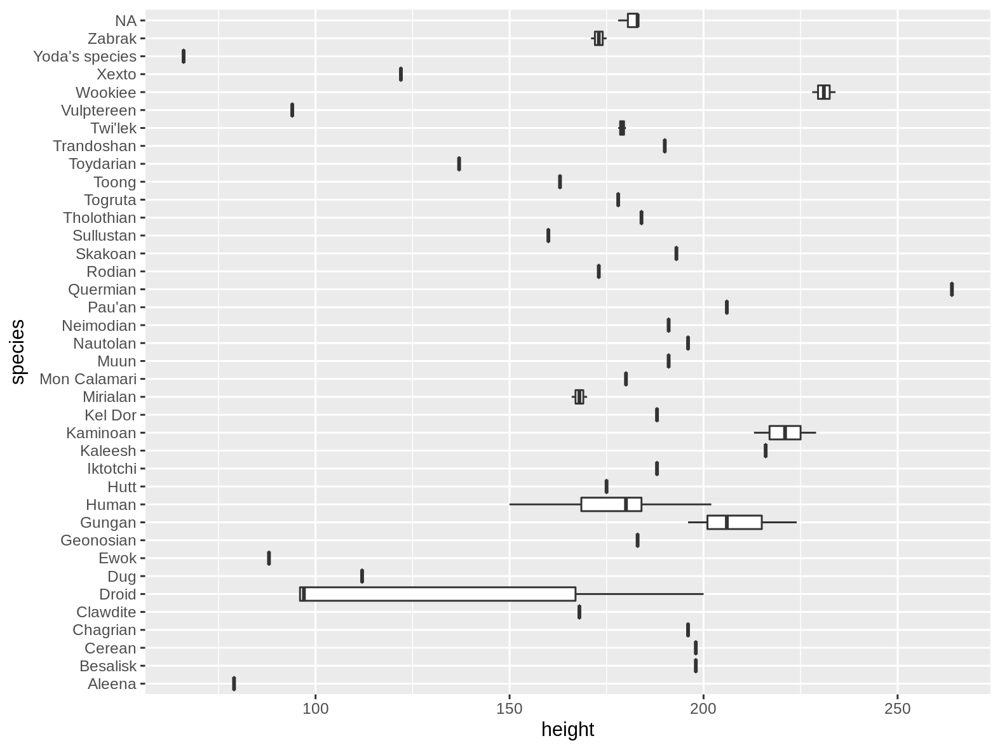

```{r console_start, include=FALSE}
console_start()
```

```{console setup_history, include=FALSE}
 export CHAPTER="06"
 export HISTFILE=/history/history_${CHAPTER}
 rm -f $HISTFILE
```


# Project Management with Make {#chapter-6-project-management-with-make}

I hope that by now you have come to appreciate that the command line is a very convenient environment for working with data.
You may have noticed that, as a consequence of working with the command line, we:

- Invoke many different commands.
- Work from various directories.
- Develop our own command-line tools.
- Obtain and generate many (intermediate) files.

Since this is an exploratory process, our workflow tends to be rather chaotic, which makes it difficult to keep track of what we’ve done.
It's important that our steps can be reproduced, by us or by others.
When you continue with a project from some time ago, chances are that you have forgotten which commands you ran, from which directory, on which files, with which parameters, and in which order.
Imagine the challenges of sharing your project with a collaborator.

You can recover some commands by digging through the output of the `history` command, but this is, of course, not a reliable approach.
A somewhat better approach would be to save your commands to a shell script.
At least this allows you and your collaborators to reproduce the project.
A shell script is, however, also a sub-optimal approach because:

- It is difficult to read and to maintain.
- Dependencies between steps are unclear.
- Every step gets executed every time, which is inefficient and sometimes undesirable.

This is where `make` really shines [@make]. `make` is a command-line tool that allows you to:

- Formalize your data workflow steps in terms of input and output dependencies.
- Run specific steps of your workflow.
- Use inline code.
- Store and retrieve data from external sources.

```{block2, type="rmdnote"}
In the first edition, this chapter used `drake` [@drake] instead of `make`.
Drake was supposed to be a successor to `make` with additional features to work with data.
Unfortunately, Drake was abandoned by its creators in 2016 with too many unresolved bugs.
That's why I've decided to use `make` instead.
```

An important, related topic is *version control*, which allows you to track changes of your project, back up your project to a server, collaborate with others, and retrieve earlier versions when things go wrong.
A popular command-line tool to do version control is `git`[@git].
It's often used in combination with GitHub, an online service for distributed version control.
Many open source projects, including [this book](https://github.com/jeroenjanssens/data-science-at-the-command-line), are hosted on GitHub.
The topic of version control is beyond the scope of this book, but I highly recommend that you look into this, especially once you start collaborating with others.
At the end of this chapter I recommend a few resources to learn more.


## Overview

Managing your data workflow with `make` is the main topic of this chapter.
As such, you’ll learn about:

- Defining your workflow with a *Makefile*.
- Thinking about your workflow in terms of input and output dependencies.
- Running tasks and building targets.

```{console ls}
cd /data/ch06
l
```

The instructions to get these files are in [Chapter 2](#chapter-2-getting-started).
Any other files are either downloaded or generated using command-line tools.


## Introducing Make

`make` organizes command execution around data and its dependencies.
Your data processing steps are formalized in a separate text file (a workflow).
Each step may have inputs and outputs.
`make` automatically resolves their dependencies and determines which commands need to be run and in which order.

This means that when you have, say, an SQL query that takes ten minutes, it only has to be executed when the result is missing or when the query has changed afterwards.
Also, if you want to (re-)run a specific step, `make` only re-runs the steps on which that step depends.
This can save you a lot of time.

Having a formalized workflow allows you to easily pick up your project after a few weeks and to collaborate with others. I strongly advise you to do this, even when you think this will be a one-off project, because you never know when you need to run certain steps again, or reuse them in another project.


## Running Tasks

By default, `make` searches for a configuration file called *Makefile* in the current directory.
It can also be named *makefile* (lower case), but I recommend calling your file *Makefile* because it's more common and that way it appears at the top of a directory listing.
Normally you would only have one configuration file per project.
Because this chapter discusses many different ones, I haven given each of them a different filename with the *.make* extension.
Let's start with the following *Makefile*:

```{console cp_numbers}
bat -A numbers.make
```

This *Makefile* contains one *target* called *`numbers`*.
A *target* is like a task.
It's usually the name of a file you'd like to create but it can also be more generic than that.
The line below, *`seq 7`*, is known as a *rule*.
Think of a rule as a recipe; one or more commands that specify how the target should be built.

The whitespace in front of the rule is a single tab character.
`make` is picky when it comes to whitespace.
Beware that some editors insert spaces when you press the **`TAB`** key, known as a soft tab, which will cause `make` to produce an error.
The following code illustrates this by expanding the tab to eight spaces:

```{console expand, callouts=c("-f", "top.")}
< numbers.make expand > spaces.make
bat -A spaces.make
make -f spaces.make
rm spaces.make
```
<1> I need to add the `-f` option (short for the `--makefile` option) because the configuration file isn't called *Makefile*, which is the default.
<2> One of the more helpful error messages you'll find at the command line!

From now on, I'll rename the appropriate file to *Makefile* because that matches real-world use more closely.
So, if I just run `make`:

```{console make_numbers}
cp numbers.make Makefile
make
```

Then we see that `make` first prints the rule itself (*`seq 7`*), and then the output generated by the rule.
This process is known as *building* a target.
If you don't specify the name of a target, then `make` will build the first target specified in the *Makefile*.
In practice though, you'll most often be specifying the target you'd want to build:

```{console make_numbers_again}
make numbers
```

```{block2, type="rmdnote"}
`make` was originally created to ease the compilation of source code, which explains some of the terminology like *target*, *rule*, and *building*.
```

In this case, we're not actually building anything, as in, we're not creating any new files.
`make` will happily *build* our target `numbers` again, because it's not finding a file called *numbers*.
In the next section I'll go into this.

Sometimes it's useful to have a target that builds regardless of whether a file with the same name exists.
Think of tasks that you need to perform as part of a project.
It's good practice to declare those targets as phony by using a special target called `.PHONY` at the top of your *Makefile*, followed by the names of the phony targets.
Here's an example *Makefile* that illustrates to use of phony targets:

```{console bat_tasks, callouts="latest"}
bat tasks.make
```
<1> Note the extra dollar sign in front of *`$(pwd)`*. This is needed because `make` uses a single dollar sign to refer to various special variables, which I'll explain later.

The above is taken from a *Makefile* I use while working on this book.
You could say that I'm using `make` as a glorified task runner.
Although this wasn't the primary purpose of `make`, it still provides a lot of value because I don't need to remember or look up what incantation I used.
Instead, I type `make publish` and the latest version of the book is published.
It's perfectly fine to put long-running commands in a *Makefile*.

And `make` can do much more for us!


## Building, For Real

Let's modify our *Makefile* such the output of the rule is written to a file *numbers*.

```{console}
cp numbers-write.make Makefile
bat Makefile
make numbers
bat numbers
```

Now we can say that `make` is actually building something.
What's more, if we run it again, we see that `make` reports that target *`numbers`* is up-to-date.

```{console}
make numbers
```

There's no need to rebuild the target *`numbers`* because the file *numbers* already exists.
That's great because `make` is saving us time by not repeating work.

In `make`, it's all about files.
But keep in mind that `make` only cares about the *name* of the target.
It does not check whether a file of the same name actually gets created by the rule.
If we were to write to a file called *nummers*, which is Dutch for "numbers", and the target was still called *`numbers`*, then `make` would always build this target. Vice versa, if the file *numbers* was created by some other process, whether automated or manual, then `make` would still consider that target up-to-date.

We can avoid some repetition by using the automatic variable `$@`, which gets expanded to the name of the target:

```{console make_numbers_write_var}
cp numbers-write-var.make Makefile
bat Makefile
```

Let's verify that this works by removing the file *numbers* and calling `make` again:

```{console bat_numbers}
rm numbers
make numbers
bat numbers
```

Another reason for `make` to rebuild a target is its dependencies, so let's discuss that next.


## Adding Dependencies

So far, we've looked at targets that exist in isolation.
In a typical data science workflow, many steps depend on other steps.
In order to properly talk about dependencies in a *Makefile*, let's consider two tasks that work with a dataset about Star Wars characters.

Here's an excerpt of that dataset:

```{console}
curl -sL 'https://raw.githubusercontent.com/tidyverse/dplyr/master/data-raw/starwars.csv' |
xsv select name,height,mass,homeworld,species |
csvlook
```

The first task computes the ten tallest humans:

```{console, callouts=c("grep", "cut", "sort", "head")}
curl -sL 'https://raw.githubusercontent.com/tidyverse/dplyr/master/data-raw/starwars.csv' |
grep Human |
cut -d, -f 1,2 |
sort -t, -k2 -nr |
head
```
<1> Only keep lines that contain the pattern *`Human`*.
<2> Extract the first two columns.
<3> Sort the lines by the second column in reverse numeric order.
<4> By default, `head` prints the first 10 lines. You can override this with the `-n` option.

The second task creates a box plot showing the distribution of heights per species (see \@ref(fig:starwars-image)):

```{console}
curl -sL 'https://raw.githubusercontent.com/tidyverse/dplyr/master/data-raw/starwars.csv' |
rush plot --x height --y species --geom boxplot > heights.png
display heights.png
```
```{r starwars-image, echo=FALSE, fig.cap="Distribution of heights per species in Star Wars", fig.align="center", out.width="90%"}

```

Let's put these two tasks into a *Makefile*.
Instead of doing this incrementally, I'd first like to show what a complete *Makefile* looks like and then explain all the syntax step by step.

```{console}
cp starwars.make Makefile
bat Makefile
```

Let's go through this *Makefile* step by step.
The first three lines are there to change some default settings related to `make` itself:

1. All rules are executed in a shell, which by default, is `sh`. With the *`SHELL`* variable we can change this to another shell, like `bash`. This way we can use everything that Bash has to offer such as for loops.
2. By default, every line in a rule is sent separately to the shell. With the special target *`.ONESHELL`* we can override this so the rule for target *`top10`* works.
3. The *`.SHELLFLAGS`* line makes Bash more strict, which is considered a [best practice](http://redsymbol.net/articles/unofficial-bash-strict-mode/). For example, because of this, the pipeline in the rule for target *`top10`* now stops as soon as there is an error.

We define a custom variable called *`URL`*.
Even though this is only used once, I find it helpful to put information like this near the beginning of the file, so that you can easily make changes to these kinds of settings.

With the special target *`.PHONY`* we can indicate which targets are not represented by files. In our case that holds for targets *`all`* and *`top10`*. These targets will now be executed regardless of whether the directory contains files with the same name.

There are five targets: *`all`*, *`data`*, *`data/starwars.csv`*, *`top10`*, and *`heights.png`*.
\@ref(fig:starwars-image) provides an overview of these targets and the dependencies between them.

```{r dependencies, echo=FALSE, fig.cap="Dependencies between targets", fig.align="center"}
knitr::include_graphics("images/dscl_0602.png")
```

Let's discuss each target in turn:

1. The target *`all`* has two dependencies but no rule. This is like a shortcut to execute one or more targets in the order in which they are specified. In this case: *`top10`* and *`heights.png`*. The target *`all`* appears as the first target in the *Makefile*, which means that if we run `make`, this target will be built.
2. The target *`data`* creates the directory *data*. Earlier I said that `make` is all about files. Well, it's also about directories. This target will only be executed when the directory *data* doesn't yet exist.
3. The target *`data/starwars.csv`* depends on the target *`data`*. If there's no *`data`* directory, it will first be created. Once all dependencies are satisfied, the rule will be executed, which involves downloading a file and saving it to a file with the same name as the target.
4. The target *`top10`* is marked as phony, so it will always be built if specified. It depends on the *`data/starwars.csv`* target. It makes use of a special variable, *`$<`* which expands to the name of the first prerequisite, namely *data/starwars.csv*.
5. The target *`heights.png`*, like target *`top10`* depends *`data/starwars.csv`* and makes use of both automatic variables we've seen in this chapter. See the [online documentation](https://www.gnu.org/software/make/manual/html_node/Automatic-Variables.html) if you'd like to learn about other automatic variables.

Last but not least, let's verify that this *Makefile* works:

```{console}
make
```

No surprises here. Because we didn't specify any target, the *`all`* target will be built, which, in turn, causes both the *`top10`* and *`heights.png`* targets to be built. The output of the former is printed to standard output and the latter creates a file *heights.png*. The *data* directory is created only once, just like the CSV file is only downloaded once.

There’s nothing more fun than just playing with your data and forgetting everything else.
But you have to trust me when I say that it’s worthwhile to keep a record of what you have done using a *Makefile*.
Not only will it make your life easier (pun intended), but you will also start thinking about your data workflow in terms of steps.
Just as with your own command-line toolbox, which you expand over time, the same holds for `make` workflows.
The more steps you have defined, the easier it gets to keep doing it, because very often you can reuse certain steps.
I hope that you will get used to `make`, and that it will make your life easier.


## Summary

One of the beauties of the command line is that it allows you to play with your data.
You can easily execute different commands and process different data files.
It is a very interactive and iterative process.
After a while, it is easy to forget which steps you have taken to get the desired result.
It's therefore very important to document your steps every once in a while.
This way, if you or one of your colleagues picks up your project after some time, the same result can be produced again by executing the same steps.

In this chapter I've shown you that just putting every command in one Bash script is suboptimal.
Instead, I proposed to use `make` as a command-line tool to manage your data workflow.
The next chapter covers the third step of the OSEMN model for data science namely exploring data.


## For Further Exploration

- The book *Managing Projects with GNU Make* by Robert Mecklenburg and the online *GNU Make Manual* provide a comprehensive and advanced overview of `make`.
- There exist plenty of other workflow managers besides `make`. Although they differ in syntax and features, they also use concepts such as targets, rules, and dependencies. Examples include [Luigi](https://luigi.readthedocs.io), [Apache Airflow](https://airflow.apache.org), and [Nextflow](https://www.nextflow.io).
- To learn more about version control, in particular `git` and GitHub, I recommend the book *Pro Git* by Scott Chacon and Ben Straub. It's [available for free](https://git-scm.com/book/en/v2). The [online GitHub documentation](https://docs.github.com/en/get-started) is also a great starting point.
