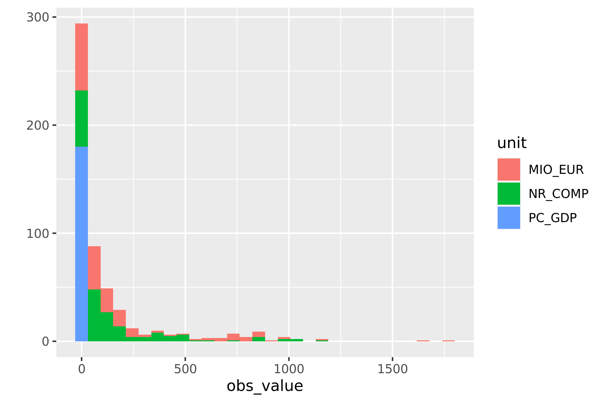
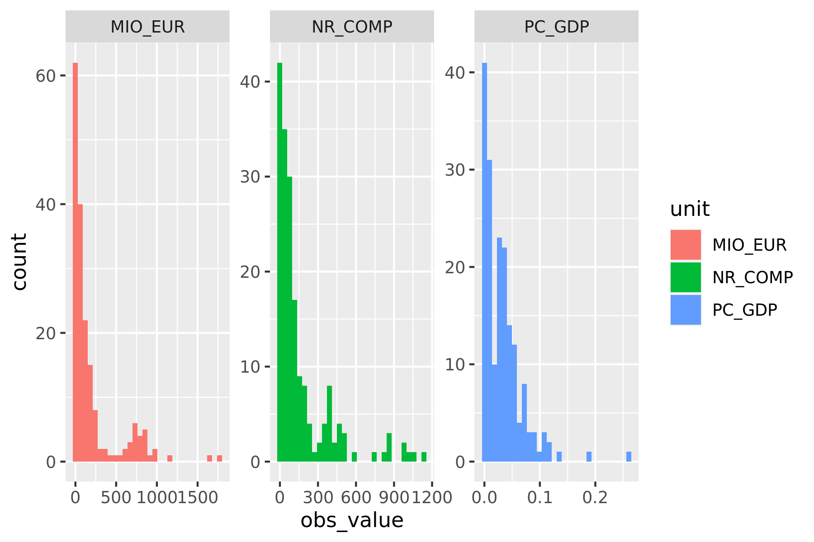
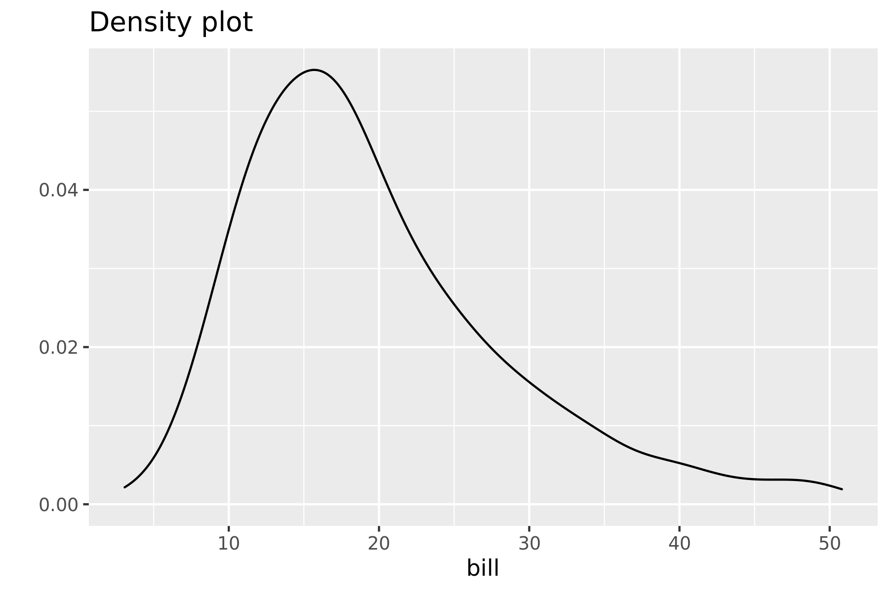

```{r console_start, include=FALSE}
console_start()
```

```{console setup_history, include=FALSE}
 export CHAPTER="07"
 export HISTFILE=/history/history_${CHAPTER}
 rm -f $HISTFILE
```

# Exploring Data {#chapter-7-exploring-data}

After all that hard work (unless you already had clean data lying around), it's time for some fun.
Now that you have obtained and scrubbed your data, you can continue with the third step of the OSEMN model, which is to explore it.

Exploring is the step where you familiarize yourself with the data.
Being familiar with the data is essential when you want to extract any value from it.
For example, knowing what kind of features the data has, means you know which ones are worth further exploration and which ones you can use to answer any questions that you have.

Exploring your data can be done from three perspectives.
The first perspective is to inspect the data and its properties.
Here, you want to find out things like what the raw data looks like, how many data points the dataset has, and which features the dataset has.

The second is to compute descriptive statistics. This perspective is useful for learning more about the individual features.
The output is often brief and textual and can therefore be printed on the command line.

The third perspective is to create visualizations of the data. From this perspective you can gain insight into how multiple features interact. I’ll discuss a way of creating visualizations that can be printed on the command line. However, visualizations are best suited to be displayed on a graphical user interface. An advantage of data visualizations over descriptive statistics is that they are more flexible and that they can convey much more information.

## Overview

In this chapter, you’ll learn how to:

- Inspect the data and its properties
- Compute descriptive statistics
- Create data visualizations inside and outside the command line

This chapter starts with the following files:

```{console cd}
cd /data/ch07
l
```

The instructions to get these files are in [Chapter 2](#chapter-2-getting-started).


## Inspecting Data and its Properties

In this section I’ll demonstrate how to inspect your dataset and its properties. Because the upcoming visualization and modeling techniques expect the data to be in a rectangular shape, I’ll assume that the data is in CSV format. You can use the techniques described in [Chapter 5](#chapter-5-scrubbing-data) to convert your data to CSV if necessary.

For simplicity sake, I’ll also assume that your data has a header.
In the first subsection I'll show a way to determine whether that's the case.
Once you know you have a header, you can continue answering the following questions:

- How many data points and features does the dataset have?
- What does the raw data look like?
- What kind of features does the dataset have?
- Can some of these features be treated as categorical?


### Header Or Not, Here I Come

You can check whether your file has a header by printing the first few lines using `head`:

```{console head_venture}
head -n 5 venture.csv
```

If the lines wrap around, add line numbers using `nl`:

```{console head_nl_venture}
head -n 3 venture.csv | nl
```

Alternatively, you can use `trim`:

```{console trim_venture}
< venture.csv trim 5
```

In this case, it's clear that the first line is a header because it contains only uppercase names and the subsequent lines contain numbers.
This is indeed quite a subjective process and it's up to you to decide whether the first line is a header or already the first data point.
When the dataset contains no header, you’re best off using the `header` tool (discussed in [Chapter 5](#chapter-5-scrubbing-data)) to correct that.


### Inspect All The Data

If you want to inspect the raw data at your own pace, then it’s probably not a good idea to use `cat`, because then all the data will be printed in one go.
I recommend using `less` [@less], which allows you to interactively inspect your data in the command line.
You can prevent long lines (as with *venture.csv*) from wrapping by specifying the `-S` option:

```{console less}
less -S venture.csv#! enter=FALSE
```

```{console less_enter, fullscreen=TRUE}
Enter Right Left#! literal=FALSE, hold=0.1, wait=0.1
```

```{console less_exit, include=FALSE}
q#! enter=FALSE, expect_prompt=TRUE
```

The greater-than signs on the right indicate that you can scroll horizontally.
You can scroll up and down by pressing **`Up`** and **`Down`**.
Press **`Space`** to scroll down an entire screen.
Scrolling horizontally is done by pressing **`Left`** and **`Right`**.
Press **`g`** and **`G`** to go to start and the end of the file, respectively.
Quitting `less` is done by pressing **`q`**.
The manual page lists all the available key bindings.

One advantage of `less` is that it does not load the entire file into memory, which means it's fast even for viewing large files.

### Feature Names and Data Types

The column (or feature) names may indicate the meaning of the feature.
You can use the following `head` and `tr` combo for this:

```{console head_tr}
< venture.csv head -n 1 | tr , '\n'
```

This basic command assumes that the file is delimited by commas.
A more robust approach is to use `csvcut`:

```{console csvcut_names}
csvcut -n venture.csv
```

You can go a step further than just printing the column names.
Besides the names of the columns, it would be very useful to know what type of values each column contains, such as a string of characters, a numerical value, or a date.
Assume that you have the following toy dataset:

```{console bat_datatypes}
bat -A datatypes.csv
```

Which `csvlook` interprets as follows:

```{console csvlook_datatypes}
csvlook datatypes.csv
```

I have already used `csvsql` in [Chapter 5](#chapter-5-scrubbing-data) to execute SQL queries directly on CSV data.
When no command-line arguments are passed, it generates the necessary SQL statement that would be needed if you were to insert this data into an actual database.
You can use the output also for to inspect what the inferred column types are.
If a column has the *NOT NULL* string printed after the data type, then that column contains no missing values.

```{console csvsql_datatypes}
csvsql datatypes.csv
```

This output is especially useful when you use other tools within the `csvkit` suite, such as  `csvgrep`, `csvsort` and `csvsql`.
For *venture.csv*, the columns are inferred as follows:

```{console csvsql_venture}
csvsql venture.csv
```


### Unique Identifiers, Continuous Variables, and Factors

Knowing the data type of each feature is not enough.
It's also essential to know what each feature represents.
Having knowledge about the domain is very useful here, but we may also get some context by looking at the data itself.

Both a string and an integer could be a unique identifier or could represent a category.
In the latter case, this could be used to assign a color to your visualization.
But if an integer denotes, say, a postal code, then it doesn’t make sense to compute the average.

To determine whether a feature should be treated as a unique identifier or categorical variable, you could count the number of unique values for a specific column:

```{console}
wc -l tips.csv
< tips.csv csvcut -c day | header -d | sort | uniq | wc -l
```

You can use `csvstat` [@csvstat], which is part of `csvkit`, to get the number of unique values for each column:

```{console}
csvstat tips.csv --unique
csvstat venture.csv --unique
```

If there's only one unique value (such as with *OBS_STATUS*), then there's a chance that you can discard that column because it doesn't provide any value.
If you wanted to automatically discard all such columns, then you could use the following pipeline:

```{console discard_columns}
< venture.csv csvcut -C $(           #<1>
  csvstat venture.csv --unique |     #<2>
  grep ': 1$' |                      #<3>
  cut -d. -f 1 |                     #<4>
  tr -d ' ' |                        #<5>
  paste -sd,                         #<6>
) | trim                             #<7>
```
<1> The `-C` option deselects columns given their locations (or names), which is provided with command substitution
<2> Obtain the number of unique values for each column in *venture.csv*
<3> Only keep the columns that contain one unique value
<4> Extract the column location
<5> Trim any white space
<6> Put all column locations on one comma-separated line
<7> Only show the first 10 lines

Having said that, I'm going to keep those columns for now.

Generally speaking, if the number of unique values is low compared to the total number of rows, then that feature might be treated as a categorical one (such as *GEO* in the case of *venture.csv*).
If the number is equal to the number of rows, it might be a unique identifier but it might also be a numerical value.
There's only one way to find out: we need to go deeper.


## Computing Descriptive Statistics

### Column Statistics

The command-line tool `csvstat` gives a lot of information. For each feature (column), it shows:

- The data type
- Whether it has any missing values (nulls)
- The number of unique values
- Various descriptive statistics (minimum, maximum, sum, mean, standard deviation, and median) for those features for which it is appropriate

Invoke `csvstat` as follows:

```{console}
csvstat venture.csv | trim 32
```

I'm only showing the first 32 lines, because this produces a lot of output. You might want to pipe this through `less`.
If you're only interested in a specific statistic, you can also use one of the following options:

- `--max` (maximum)
- `--min` (minimum)
- `--sum` (sum)
- `--mean` (mean)
- `--median` (median)
- `--stdev` (standard deviation)
- `--nulls` (whether column contains nulls)
- `--unique` (unique values)
- `--freq` (frequent values)
- `--len` (maximum value length)

For example:

```{console csvstat_null}
csvstat venture.csv --freq | trim
```

You can select a subset of features with the `-c` option, which accepts both integers and column names:

```{console csvstat_c}
csvstat venture.csv -c 3,GEO
```

```{block2, type="rmdtip"}
Keep in mind that `csvstat`, just like `csvsql`, employs heuristics to determine the data type, and therefore may not always get it right.
I encourage you to always do a manual inspection as discussed in the previous subsection.
Moreover, even though the type may be a string or integer, that doesn’t say anything about how it should be used.
```

As a nice extra, `csvstat` outputs, at the very end, the number of data points (rows).
Newlines and commas inside values are handled correctly.
To only see that last line, you can use `tail`.
Alternatively, you can use `xsv`, which only returns the actual number of rows.

```{console csvstat_count}
csvstat venture.csv | tail -n 1
xsv count venture.csv
```

Note that these two options are different from using `wc -l`, which simply counts the number of newlines.


### R One-Liners on the Shell

In this section I'd like to introduce you to a command-line tool called `rush` [@rush],
which enables you to leverage the statistical programming environment `R` [@R] directly from the command line.
Before I explain what `rush` does and why it exists, lets talk a bit about `R` itself.

`R` is a very powerful statistical software package to do data science.
It’s an interpreted programming language, has an extensive collection of packages, and offers its own REPL, which allows you, similar to the command line, to play with your data.
Unfortunately, once you start R, you’re in an interactive session that is separated from the command line.

Imagine that you have a CSV file called *tips.csv*, and you would like compute the tip percentage, and save the result.
To accomplish this in `R` you would first run, `R`:

```{console start_r, keep_last_prompt=TRUE, callouts=list(1)}
R --quiet
```
<1> I use the `--quiet` option here to suppress the rather long startup message

And then run the following code:

```{console r_code, keep_last_prompt=TRUE}
library(tidyverse)                            #<1>
df <- read_csv("tips.csv")                    #<2>
df <- mutate(df, percent = tip / bill * 100)  #<3>
write_csv(df, "percent.csv")                  #<4>
q("no")                                       #<5>
```
<1> Load any required packages
<2> Read in the CSV file and assign it to a variable
<3> Compute a new column *percent*
<4> Save the result to disk
<5> Exit `R`

Afterwards, you can continue with the saved file *percent.csv* on the command line.

```{console}
< percent.csv trim 5
```

Note that only the third line is associated with what you want to accomplish specifically.
The other lines are necessary boilerplate.
Typing in this boilerplate in order to accomplish something simple is cumbersome and breaks your workflow.
Sometimes, you only want to do one or two things at a time to your data.
Wouldn't it be great if you could harness the power of `R` and to use it from the command line?

This is where `rush` comes in.
Let’s perform the same task as before, but now using `rush`:

```{console rush_tips}
rm percent.csv
rush run -t 'mutate(df, percent = tip / bill * 100)' tips.csv > percent.csv
< percent.csv trim 5
```

These small one-liners are possible because `rush` takes care of all the boilerplate.
In this case I'm using the `run` subcommand. There's also the `plot` subcommand, which I'll use in the next section to produce data visualizations quickly.
If you're passing in any input data, then  by default, `rush` assumes that it's in CSV format with a header and a comma as the delimiter.
Moreover, the column names are sanitized so that they are easier to work with.
You can override these defaults using the `--no-header` (or `-H`), `--delimiter` (or `-d`), and `--no-clean-names` (or `-C`) options, respectively.
The help gives a good overview of the available options for the `run` subcommand:

```{console rush_run_help}
rush run -h
```

Under the hood, `rush` generates an `R` script and subsequently executes it.
You can view this generated script by specifying the `--dry-run` (or `-n`) option:

```{console rush_dryrun}
rush run -nt 'mutate(df, percent = tip / bill * 100)' tips.csv
```

This generated script:

- Writes out the shebang (`#!`; see [Chapter 4](#chapter-4-creating-reusable-command-line-tools)) needed for running an `R` script from the command line.
- Imports the *tidyverse* and *glue* packages.
- Loads `tips.csv` as a data frame, cleans the column names, and assigns it to a variable *df*.
- Runs the specified expression.
- Prints the result to standard output.

You could redirect this generated script to a file and easily turn it into a new command-line tool because of the shebang.

The output of `rush` doesn’t have to be a in CSV format per se. Here, I compute the mean tip percent, the maximum party size, the unique values of the time column, the correlation between the bill and the tip. Finally, I extract an entire column (but only show the first 10 values).

```{console rush_run_more}
< percent.csv rush run 'mean(df$percent)' -
< percent.csv rush run 'max(df$size)' -
< percent.csv rush run 'unique(df$time)' -
< percent.csv rush run 'cor(df$bill, df$tip)' -
< percent.csv rush run 'df$tip' - | trim
```

That last dash means that `rush` should read from standard input.

So now, if you want to do one or two things to your data set with `R`, you can specify it as a one-liner, and keep on working on the command line.
All the knowledge that you already have about `R` can now be used from the command line. With `rush`, you can even create sophisticated visualizations, as I'll show you in the next section.


## Creating Visualizations

In this section, I'm going to show you 

It's helpful to distinguish between *creating* a visualization at the command line and *viewing* a visualization at the command line.
Of course you're going to use the command line to *create* the visualization.
But sometimes you cannot *view* any pixels and you're stuck with the capabilities of your terminal.


### Displaying Images from the Command Line

Before we dive into creating data visualizations I'd first like to explain how you can actually display them.
Let's take the image *tips.png* as an example (see \@ref(fig:plot-demo)), which is a data visualization created using `rush` and the *tips.csv* dataset.
(Don't worry about the syntax or the contents for now.)

```{console plot_demo_png}
rush plot --x bill --y tip --color size --facets '~day' tips.csv > tips.png
display tips.png
```
```{r plot-demo, echo=FALSE, fig.cap="Demo image", fig.align="center", out.width="90%"}
knitr::include_graphics("images/tips.png")
```

I use the `display` tool to magically insert the image in the book, but if you run `display` you'll find that it doesn't work.
That's because displaying images from the command line is actually quite tricky.
Depending on your setup, you'll have different options available.
I know of four options, each with their own advantages and disadvantages.

```{r screenshot-display-ansi-and-inline, echo=FALSE, fig.cap="Displaying an image in the terminal via ASCII characters and ANSI escape sequences (top) and via the iTerm2 inline images protocol (bottom)", fig.align="center"}
knitr::include_graphics("images/screenshot_display_ansi_and_inline.png")
```

Option 1 is to display the image inside the terminal as shown at the top of \@ref(fig:screenshot-display-ansi-and-inline).
This output is generated by `rush` when the standard output is not redirected to a file.
It's based on ASCII characters and ANSI escape sequences, so it's available in every terminal.
Depending on how you're reading this book, the following output will match the screenshot or not:

```{console plot_demo_ansi, trailing_spaces=TRUE, remove=c(-2, -1)}
rush plot --x bill --y tip --color size --facets '~day' tips.csv
```

If you only see ASCII characters, then that's because the ANSI escape sequences, which provide the colors, are not supported.
Fortunately, if you run the above command yourself, it will look just like the screenshot.

Option 2, as seen at the bottom of \@ref(fig:screenshot-display-ansi-and-inline), also diplays images inside the terminal.
This is the iTerm2 terminal, which is only available for macOS, and uses the [Inline Images Protocol](https://iterm2.com/documentation-images.html) through a small script (which I have named `display`).
This script is not included with the Docker image, but you can easily install it:

```{console}
curl -s "https://iterm2.com/utilities/imgcat" > display#!enter=FALSE
C-C#!literal=FALSE
chmod u+x display#!enter=FALSE
C-C#!literal=FALSE
```

If you're not using iTerm2 on macOS, then there might be other options available to display images inline.
Please consult your favorite search engine. 

```{r screenshot-display-preview-and-browser, echo=FALSE, fig.cap="Displaying an image externally via a file explorer and an image viewer (left) and via a webserver and a browser (right)", fig.align="center"}
knitr::include_graphics("images/screenshot_display_preview_and_browser.png")
```

Option 3, 

\@ref(fig:screenshot-display-preview-and-browser) is a screenshot of options 3 and 4.


You can create a graphical version (by default in PNG format) by redirecting the output to a file.
I use the `!!` syntax to repeat the previous command.

<!-- ```{console plot_demo_png} -->
<!-- !! > tips.png -->
<!-- display tips.png -->
<!-- ``` -->


### Plotting in a Rush

<!-- Using the same syntax, `rush plot` can create both graphical visualizations (consisting of pixels) and textual visualizations (consisting of ASCII characters and ANSI escape sequences to provide colors). -->
<!-- Use option `--dpi` to change dpi. -->
<!-- This is the pattern that I follow. First ansi then png. -->
rush plot
qplot
rush plot --help


### Bar chart

```{console plot_bar_ansi, trailing_spaces=TRUE, remove=c(-2, -1)}
rush plot -x time tips.csv
```


```{console plot_bar_png}
!! > plot-bar.png
display plot-bar.png
```
```{r plot_bar_image, echo=FALSE, fig.cap="Bar plot", fig.align="center", out.width="90%"}
knitr::include_graphics("images/plot-bar.png")
```

### Histogram

The column type that is specified with the `-x` option is automatically detected, and determines the geometry.
In this it's a histogram because *OBS_VALUE* is continuous.
If the `--fill` option is specified, it creates a stacked histogram.

```{console plot_hist_ansi, trailing_spaces=TRUE, remove=c(-2, -1)}
rush plot -x obs_value --fill unit venture.csv
```

The graphical version looks like this:

```{console plot_hist_png}
!! > obs-histogram.png
display obs-histogram.png
```
```{r plot_hist_image, echo=FALSE, fig.cap="Histogram", fig.align="center", out.width="90%"}

```
Something strange is going on with *OBS_VALUE*. It takes on vastly different values depending on the *UNIT*.
Let's invoke `ggplot2` directly to investigate:

```{console plot_facets_ansi, trailing_spaces=TRUE, remove=c(-2, -1)}
cat venture.csv |
rush run --library ggplot2 'ggplot(df, aes(x = obs_value, fill = unit)) +
geom_histogram() +
facet_wrap(~ unit, scales = "free")' -
```

The graphical version looks much more clear:


```{console}
!! > obs-facets.png
display obs-facets.png
```
```{r, echo=FALSE, fig.cap="Histogram with facets", fig.align="center", out.width="90%"}

```

### Density plot


```{console plot_density_ansi, trailing_spaces=TRUE, remove=c(-2, -1)}
rush plot -x bill --geom density --title "Density plot" tips.csv
```

```{console}
!! > bill-density.png
display bill-density.png
```
```{r, echo=FALSE, fig.cap="Density plot", fig.align="center", out.width="90%"}

```

### Summary

In this chapter we've looked at various ways to explore your data.
Both textual and graphical data visualizations have their pros and cons.
The latter are obviously of much higher quality.
The only down-side would be that the output is not viewable from the command line.
This is where textual visualizations may come in handy.
At least `rush` has, thanks to `R` and `ggplot2`, a consistent syntax for both types.
The next chapter is, once again, an intermezzo chapter in which I discuss how you can speed up your commands and pipelines.
Feel free to read that chapter at a later point if you can't wait to start modeling your data in Chapter 9.


## For Further Exploration

- A proper `ggplot2` tutorial is unfortunately beyond the scope of this book. If you want to get better at visualizing your data I strongly recommend that you invest some time in understanding the power and beauty of the grammar of graphics. Chapters 3 and 28 of the book [*R for Data Science*](https://r4ds.had.co.nz/) by Hadley Wickham and Garrett Grolemund are an excellent resource.
