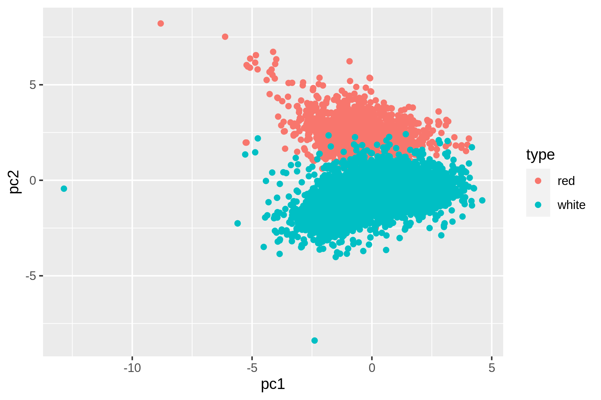
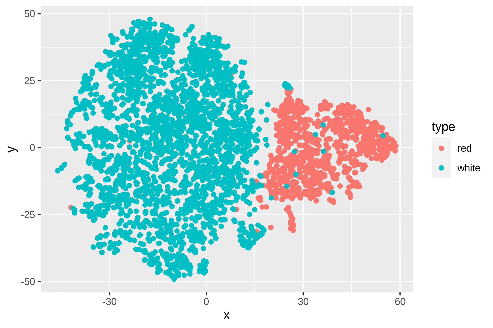
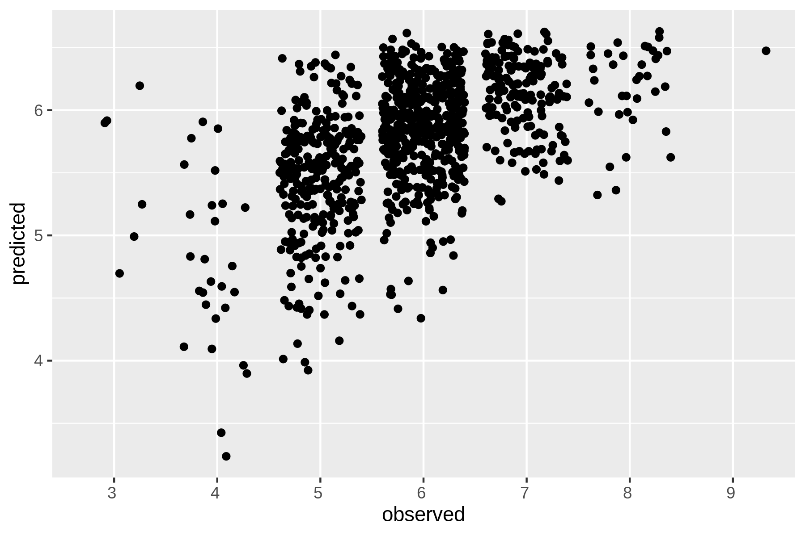

```{r console_start, include=FALSE}
console_start()
```

```{console setup_history, include=FALSE}
 export CHAPTER="09"
 export HISTFILE=/history/history_${CHAPTER}
 rm -f $HISTFILE
```


# Modeling Data {#chapter-9-modeling-data}

In this chapter we’re going to perform the fourth step of the OSEMN model: modeling data.
Generally speaking, a model is an abstract or higher-level description of your data.
Modeling is a bit like creating visualizations in the sense that we're taking a step back from the individual data points to see the bigger picture.

Visualizations are characterized by shapes, positions, and colors: we can interpret them by looking at them.
Models, on the other hand, are internally characterized by numbers, which means that computers can use them to do things like make predictions about a new data points.
(We can still visualize models so that we can try to understand them and see how they are performing.)

In this chapter I’ll consider three types of algorithms commonly used to model data:

- Dimensionality reduction
- Regression
- Classification

These algorithms come from the field of statistics and machine learning, so I'm going to change the vocabulary a bit.
Let’s assume that I have a CSV file, also known as a *dataset*.
Each row, except for the header, is considered to be a *data point*.
Each data point has one or more *features*, or properties that have been measured.
Sometimes, a data point also has a *label*, which is, generally speaking, a judgment or outcome.
This becomes more concrete when I introduce the wine dataset below.

The first type of algorithm (dimensionality reduction) is most often unsupervised, which means that they create a model based on the features of the dataset only.
The last two types of algorithms (regression and classification) are by definition supervised algorithms, which means that they also incorporate the labels into the model.

```{block2, type="rmdcaution"}
This chapter is by no means an introduction to machine learning.
That implies that I must skim over many details.
My general advice is that you become familiar with an algorithm before applying it to your data.
At the end of this chapter I recommend a few books about machine learning. 
```

## Overview

In this chapter, you’ll learn how to:

- Reduce the dimensionality of your dataset using `tapkee` [@tapkee].
- Predict the quality of white wine using `vw` [@vw].
- Classify wine as red or white using `skll` [@skll].

This chapter starts with the following file:

```{console cd}
cd /data/ch09
l
```

The instructions to get these files are in [Chapter 2](#chapter-2-getting-started).
Any other files are either downloaded or generated using command-line tools.


## More Wine Please!

Throughout this chapter, I’ll be using a dataset of wine tasters' notes on red and white varieties of Portuguese wine called vinho verde.
Each data point represents a wine. Each wine is rated on 11 physicochemical properties: (1) fixed acidity, (2) volatile acidity, (3) citric acid, (4) residual sugar, (5) chlorides, (6) free sulfur dioxide, (7) total sulfur dioxide, (8) density, (9) pH, (10) sulphates, and (11) alcohol.
There is also an overall quality score between 0 (very bad) and 10 (excellent), which is the median of at least three evaluation by wine experts. More information about this dataset is available at the [UCI Machine Learning Repository](http://archive.ics.uci.edu/ml/datasets/Wine+Quality).

The dataset is split into two files: one for white wine and one for red wine.
The very first step is to obtain the two files using `curl` (and of course `parallel` because I haven’t got all day):

```{console}
parallel "curl -sL http://archive.ics.uci.edu/ml/machine-learning-databases/wine-quality/winequality-{}.csv > wine-{}.csv" ::: red white#!enter=FALSE
C-C#!literal=FALSE
```

The triple colon is just another way to pass data to `parallel`.

```{console cp_cache_wine}
cp /data/.cache/wine-*.csv .
```

Let’s inspect both files and count the number of lines:

```{console, callouts=c(1, 2)}
< wine-red.csv nl |
fold |
trim
< wine-white.csv nl | fold | trim
wc -l wine-{red,white}.csv
```
<1> For clarity I use `nl` to add line numbers.
<2> To see the entire header, I use `fold`.

At first sight this data appears to be quite clean.
Still, let’s scrub it so that it conforms more with what most command-line tools expect.
Specifically, I’ll:

- Convert the header to lowercase.
- Replace the semi-colons with commas.
- Replace spaces with underscores.
- Remove unnecessary quotes.

The tool `tr` can take care of all these things.
Let’s use a for loop this time---for old times’ sake---to process both files:

```{console}
for COLOR in red white; do
< wine-$COLOR.csv tr '[A-Z]; ' '[a-z],_' | tr -d \" > wine-${COLOR}-clean.csv
done
```

Let’s also create a single dataset by combining the two files.
I’ll use `csvstack`[@csvstack] to add a column named *type*, which will be "red" for rows of the first file, and "white" for rows of the second file:

```{console, callouts=c(1, 2)}
csvstack -g red,white -n type wine-{red,white}-clean.csv |
xsv select 2-,1 > wine.csv
```
<1> The new column *type* is placed at the beginning by `csvstack`.
<2> Some algorithms assume that the label is the last column, so I use `xsv` to move the column *type* to the end.

It’s good practice to check whether there are any missing values in this dataset, because most machine learning algorithms can't handle them:

```{console}
csvstat wine.csv --nulls
```

Excellent!
If there were any missing values, we could fill them with, say, the average or most common value of that feature.
An alternative, less subtle approach is to remove any data points that have at least one missing value.
Just out of curiosity, let’s see what the distribution of quality looks like for both red and white wines.

```{console}
rush run -t 'ggplot(df, aes(x = quality, fill = type)) + geom_density(adjust = 3, alpha = 0.5)' wine.csv > wine-quality.png
display wine-quality.png
```
```{r plot_wine_quality, echo=FALSE, fig.cap="Comparing the quality of red and white wines using a density plot", fig.align="center", out.width="90%"}
knitr::include_graphics("images/wine-quality.png")
```

From the density plot you can see the quality of white wine is distributed more towards higher values.
Does this mean that white wines are overall better than red wines, or that the white wine experts more easily give higher scores than red wine experts?
That’s something that the data doesn't tell us.
Or is there perhaps a relationship between alcohol and quality?
Let’s use `rush` to find out:

```{console}
rush plot --x alcohol --y quality --color type --geom smooth wine.csv > wine-alcohol-vs-quality.png
display wine-alcohol-vs-quality.png
```
```{r plot_wine_alchohol_vs_quality, echo=FALSE, fig.cap="Relationship between the alcohol contents of wine and its quality", fig.align="center", out.width="90%"}
knitr::include_graphics("images/wine-alcohol-vs-quality.png")
```

Eureka! Ahem, let’s carry on with some modeling, shall we?


## Dimensionality Reduction with Tapkee

The goal of dimensionality reduction is to map high-dimensional data points onto a lower dimensional mapping.
The challenge is to keep similar data points close together on the lower-dimensional mapping.
As we’ve seen in the previous section, our wine dataset contains 13 features.
I’ll stick with two dimensions because that’s straightforward to visualize.

Dimensionality reduction is often regarded as part of exploration.
It’s useful for when there are too many features for plotting.
You could do a scatter-plot matrix, but that only shows you two features at a time.
It’s also useful as a pre-processing step for other machine learning algorithms.

Most dimensionality reduction algorithms are unsupervised.
This means that they don’t employ the labels of the data points in order to construct the lower-dimensional mapping.

In this section I’ll look at two techniques: PCA, which stands for Principal Components Analysis [@Pearson1901] and t-SNE, which stands for t-distributed Stochastic Neighbor Embedding [@van2008visualizing].


### Introducing Tapkee

Tapkee is a C++ template library for dimensionality reduction [@Lisitsyn2013].
The library contains implementations of many dimensionality reduction algorithms, including:

- Locally Linear Embedding
- Isomap
- Multidimensional Scaling
- PCA
- t-SNE

More information about these algorithms can be found on [Tapkee’s website](http://tapkee.lisitsyn.me/).
Although Tapkee is mainly a library that can be included in other applications, it also offers a command-line tool `tapkee`.
I’ll use this to perform dimensionality reduction on our wine dataset.


### Linear and Non-linear Mappings

First, I’ll scale the features using standardization such that each feature is equally important.
This generally leads to better results when applying machine learning algorithms.

To scale I use `rush` and the `tidyverse` package.

```{console, callouts=c(2:5)}
rush run --tidyverse --output wine-scaled.csv \
'select(df, -type) %>%
scale() %>%
as_tibble() %>%
mutate(type = df$type)' wine.csv
csvlook wine-scaled.csv
```
<1> I need to temporary remove the column *`type`* because `scale()` only works on numerical columns.
<2> The `scale()` function accepts a data frame, but returns a matrix.
<3> The function `as_tibble()` converts the matrix back to a data frame.
<4> Finally, I add back the *`type`* column.

Now we apply both dimensionality reduction techniques and visualize the mapping using `Rio-scatter`:

```{console create_wine_pca, callouts=1:3}
xsv select '!type' wine-scaled.csv |
header -d |
tapkee --method pca |
tee wine-pca.txt | trim
```
<1> Deselect the column *`type`*
<2> Remove the header
<3> Apply PCA

```{console apply_pca, callouts=1:2}
< wine-pca.txt header -a pc1,pc2 |
paste -d, - <(xsv select type wine-scaled.csv) |
tee wine-pca.csv | csvlook
```
<1> Add back the header with columns *`pc1`* and *`pc2`*
<2> Add back the column *`type`*

Now we can create a scatter plot:

```{console plot_pca}
rush plot --x pc1 --y pc2 --color type --shape type wine-pca.csv > wine-pca.png
display wine-pca.png
```
```{r, echo=FALSE, fig.cap="Linear dimensionality reduction with PCA", fig.align="center", out.width="90%"}

```

Let's perform t-SNE with the same approach:

```{console apply_tsne, callouts=1:6}
xsv select '!type' wine-scaled.csv |
header -d |
tapkee --method t-sne |
header -a x,y |
paste -d, - <(xsv select type wine-scaled.csv) |
rush plot --x x --y y --color type --shape type > wine-tsne.png
```
<1> Deselect the column *`type`*
<2> Remove the header
<3> Apply t-SNE
<4> Add back the header with columns *`x`* and *`y`*
<5> Add back the column *`type`*
<6> Create a scatter plot

```{console}
display wine-tsne.png
```
```{r, echo=FALSE, fig.cap="Non-linear dimensionality reduction with t-SNE", fig.align="center", out.width="90%"}

```

We can see that t-SNE does a better job than PCA at separating the red and white wines based on their physicochemical properties.
These scatter plots verify that the dataset has a certain structure; there's a relationship between the features and the labels.
Knowing this, I'm comfortable moving forward by applying supervised machine learning.
I'll start with a regression task and then continue with a classification task.


## Regression with Vowpal Wabbit

In this section, I'm going to create a model that predicts the quality of the white wine, based on their physicochemical properties.
Because the quality is a number between 0 and 10, we can consider this as a regression task.

For this I'll be using Vowpal Wabbit, or `vw`. 


### Preparing the Data

Instead of working with CSV, `vw` has its own data format.
The tool `csv2vw`[@csv2vw] can, as its name implies, convert CSV to this format.
The `--label` option is used to indicate which column contains the labels.
Let's examine the result:

```{console}
csv2vw wine-white-clean.csv --label quality | trim
```

In this format, each line is one data point.
The line starts with the label, followed by a pipe symbol and then feature name/value pairs separated by spaces.
While this format may seem overly verbose when compared to the CSV format, it does offer more flexibility such as weights, tags, namespaces, and a sparse feature representation.
With the wine dataset we don't need this flexibility, but it might be useful when applying `vw` to more complicated problems.
This [article](https://github.com/VowpalWabbit/vowpal_wabbit/wiki/Input-format) explains the `vw` format in more detail.

One we've created, or *trained* a regression model, it can be used to make predictions about new, unseen data points.
In other words, if we give the model a wine it hasn't seen before, it can predict, or *test*, its quality.
To properly evaluate the accuracy of these predictions, we need to set aside some data that will not be used for training.
It's common to use 80% of the complete dataset for training and the remaining 20% for testing.

I can do this by first splitting the complete dataset into five equal parts using `split`[@split].
I verify the number of data points in each part using `wc`.

```{console, callouts=2}
csv2vw wine-white-clean.csv --label quality |
shuf |
split -d -n r/5 - wine-part-
wc -l wine-part-*
```
<1> The tool `shuf`[@shuf] randomizes the dataset to ensure that both the training and the test have similar quality distribution.

Now I can use the first part (so 20%) for the testing set *wine-test.vw* and combine the four remaining parts (so 80%) into the training set *wine-train.vw*:

```{console}
mv wine-part-00 wine-test.vw
cat wine-part-* > wine-train.vw
rm wine-part-*
wc -l wine-*.vw
```

Now we're ready to train a model using `vw`.


### Training the Model

The tool `vw` accepts many different options (nearly 400!).
Luckily, you don't need all of them in order to be effective.
To annotate the options I use here, I’ll put each one on a separate line:

```{console, callouts=2:9}
vw \
--data wine-train.vw \
--final_regressor wine.model \
--passes 10 \
--cache_file wine.cache \
--nn 3 \
--quadratic :: \
--l2 0.000005 \
--bit_precision 25
```
<1> The file *wine-train.vw* is used to train the model.
<2> The model, or *regressor*, will be stored in the file *wine.model*.
<3> Number of training passes.
<4> Caching is needed when making multiple passes.
<5> Use a neural network with 3 hidden units.
<6> Create and use quadratic features, based on all input features. Any duplicates will be removed by `vw`.
<7> Use l2 regularization.
<8> Use 25 bits to store the features.

Now that I have trained a regression model, let's use it to make predictions.


### Testing the Model

The model is stored in the file *wine.model*.
To use that model to make predictions, I run `vw` again, but now with a different set of options:

```{console, callouts=2:6}
vw \
--data wine-test.vw \
--initial_regressor wine.model \
--testonly \
--predictions predictions \
--quiet
bat predictions | trim
```
<1> The file *wine-test.vw* is used to test the model.
<2> Use the model stored in the file *wine.model*.
<3> Ignore label information and just test.
<4> The predictions are stored in a file called *predictions*.
<5> Don't output diagnostics and progress updates.

Let's use `paste` to combine the predictions in the file *predictions* with the true, or *observed*, values that are in the file *wine-test.vw*.
Using `awk`, I can compare the predicted values with the observed values and compute the mean absolute error (MAE).
The MAE tells us how far off `vw` is on average, when it comes to predicting the quality of a white wine.

```{console callouts="cowsay"}
paste -d, predictions <(cut -d '|' -f 1 wine-test.vw) |
tee results.csv |
awk -F, '{E+=sqrt(($1-$2)^2)} END {print "MAE: " E/NR}' |
cowsay
```

So, the predictions are on average about 0.6 points off.
Let's visualize the relationship between the observed values and the predicted values using `rush plot`:

```{console}
< results.csv header -a "predicted,observed" |
rush plot --x observed --y predicted --geom jitter > wine-regression.png
display wine-regression.png
```
```{r, echo=FALSE, fig.cap="Regression with Vowpal Wabbit", fig.align="center", out.width="90%"}

```

I can imagine that the options used to the train the model can be a bit overwhelming.
Let's see how `vw` performs when I use all the default values:

```{console, callouts=c(1, 3, 5)}
vw -d wine-train.vw -f wine2.model --quiet
vw -data wine-test.vw -i wine2.model -t -p predictions --quiet
paste -d, predictions <(cut -d '|' -f 1 wine-test.vw) |
awk -F, '{E+=sqrt(($1-$2)^2)} END {print "MAE: " E/NR}'
```
<1> Train a regression model
<2> Test the regression model
<3> Compute mean absolute error

Apparently, with the default values, the MAE is 0.04 higher, meaning that the predictions are slightly worse.

In this section, I've only been able to scratch the surface of what `vw` can do.
There's reason why it accepts so many options.
Besides regression, it also supports, among other things, binary classification, multi-class classification, reinforcement learning, and Latent Dirichlet Allocation. 
[Its website](https://vowpalwabbit.org/) contains many tutorials and articles to learn more.


## Classification with SciKit-Learn Laboratory

<!-- TODO: Explain SKLL better -->

In this section I'm going to train a classification model, or *classifier*, that predicts whether a wines is either red or white.
While we could use `vw` for this, I'd like to demonstrate another tool: SciKit-Learn Laboratory (SKLL).
As the name implies, it's built on top of SciKit-Learn, a popular machine learning package for Python.
SKLL, itself a Python package, provides the `run_experiment` tool, which makes it possible to use SciKit-Learn from the command line.
Instead of `run_experiment`, I use the alias `skll` because I find it easier to remember as it corresponds to the package name:

```{console skll_alias}
alias skll=run_experiment
skll
```


### Preparing the Data

`skll` expects the training and test dataset to have the same filenames, located in separate directories.
Because its predictions are not necessarily in the same order as the original dataset, I add a column, *`id`*, that contains a unique identifier so that I can match the predictions with the correct data points.
Let's create a balanced dataset:

```{console skll_create_features, callouts=c("NUM_RED", "csvstack", "nl", "sed")}
NUM_RED="$(< wine-red-clean.csv wc -l)"
csvstack -n type -g red,white \
wine-red-clean.csv \
<(< wine-white-clean.csv body shuf | head -n $NUM_RED) |
body shuf |
nl -s, -w1 -v0 |
sed '1s/0,/id,/' |
tee wine-balanced.csv | csvlook
```
<1> Store the number of red wines in variable *`NUM_RED`*.
<2> Combine all red wines with a random sample of white wines.
<3> Add "line numbers" using `nl` in front of each line.
<4> Replace the "0" on the first line with "id" so that it's a proper column name.

Let's split this balanced dataset into a training set and a test set:

```{console}
mkdir -p {train,test}
HEADER="$(< wine-balanced.csv header)"
< wine-balanced.csv header -d | shuf | split -d -n r/5 - wine-part-
wc -l wine-part-*
cat wine-part-00 | header -a $HEADER > test/features.csv && rm wine-part-00
cat wine-part-* | header -a $HEADER > train/features.csv && rm wine-part-*
wc -l t*/features.csv
```

Now that I have a balanced training dataset and a balanced test dataset, I can continue with building a classifier.


### Running the Experiment

Training a classifier in `skll` is done by defining an experiment in a configuration file.
It consists of several sections that specify, for example, where to look for the datasets, which classifiers 
Here's the configuration file *classify.cfg* that I'll use:

```{console bat_cfg}
bat classify.cfg
```

I run the experiment using `skll`:

```{console skll}
skll -l classify.cfg 2>/dev/null
```

The option`-l` specifies to run in local mode.
`skll` also offers the possibility to run experiments on clusters.
The time it takes to run an experiment depends on the complexity of the chosen algorithms and the size of the data.


### Parsing the Results

Once all classifiers have been trained and tested, the results can be found in the directory *output*:

```{console ls_output}
ls -1 output
```

`skll` generates four files for each classifier: one log, two with results, and one with predictions.
I  extract the algorithm names and sort them by their accuracies using the following SQL query:

```{console}
< output/wine_summary.tsv csvsql --query "SELECT learner_name, accuracy FROM stdin ORDER BY accuracy DESC" | csvlook -I
```

The relevant column here is *`accuracy`*, which indicates the percentage of data points that are classified correctly.
From this we see that actually all algorithms are performing really well.
The RandomForestClassifier comes out as best performing algorithm, closely followed by KNeighborsClassifier.

Each JSON file contains a confusion matrix, giving you additional insight into the performance of each classifier.
A confusion matrix is a table where the columns refer to the true labels (red and white) and the rows refer to the predicted labels. 
Higher numbers on the diagonal mean more correct predictions.
With `jq` I can print the name of each classifier and extract the associated confusion matrix:

```{console}
jq -r '.[] | "\(.learner_name):\n\(.result_table)\n"' output/*.json
```

A confusion matrix is especially helpful when you have more than two classes, so that you can see which kind of misclassifications happen, and when the cost of an incorrect classification is not the same for each class.

From a usage perspective, it's interesting to consider that `vw` and `skll` take two different approaches.
`vw` uses command-line options, whereas `skll` requires a separate file.
Both approaches have their advantages and disadvantages. 
While command-line options enable more ad-hoc usage, a configuration file is perhaps easier to reproduce. 
Then again, as we've seen, invoking `vw` with any number of options can easily be placed in script or in a *Makefile*.
The opposite, making `skll` accept options such that it doesn't need a configuration file, is less straightforward.


## Summary

In this chapter we've looked at modeling data.
Through examples I dived into three different machine learning tasks namely dimensionality reduction which is unsupervised and regression and classification which are both supervised.
A proper machine learning tutorial is unfortunately beyond the scope of this book.
In the next section I have a couple of recommendations in case you want to learn more about machine learning.
This was the fourth and last step of the OSEMN model for data science that I'm covering in this book.
The next chapter is the last intermezzo chapter and will be about leveraging the command line elsewhere.


## For Further Exploration

- The book *Python Machine Learning* by Sebastian Raschka and Vahid Mirjalili offers a comprehensive overview of machine learning and how to apply it using Python.
- The later chapters of *R for Everyone* by Jared Lander explain how to accomplish various machine learning tasks using R.
- If you want to get a deeper understanding of machine learning, I highly recommend you pick up *Pattern Recognition and Machine Learning* by Christopher Bishop and *Information Theory, Inference, and Learning Algorithms* by David MacKay.
- If you're interested in learning more about the t-SNE algorithm, I recommend the original article about it: *Visualizing Data Using T-SNE* by Laurens van der Maaten and Geoffrey Hinton.

