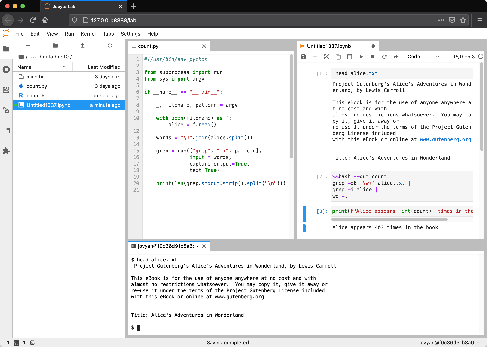
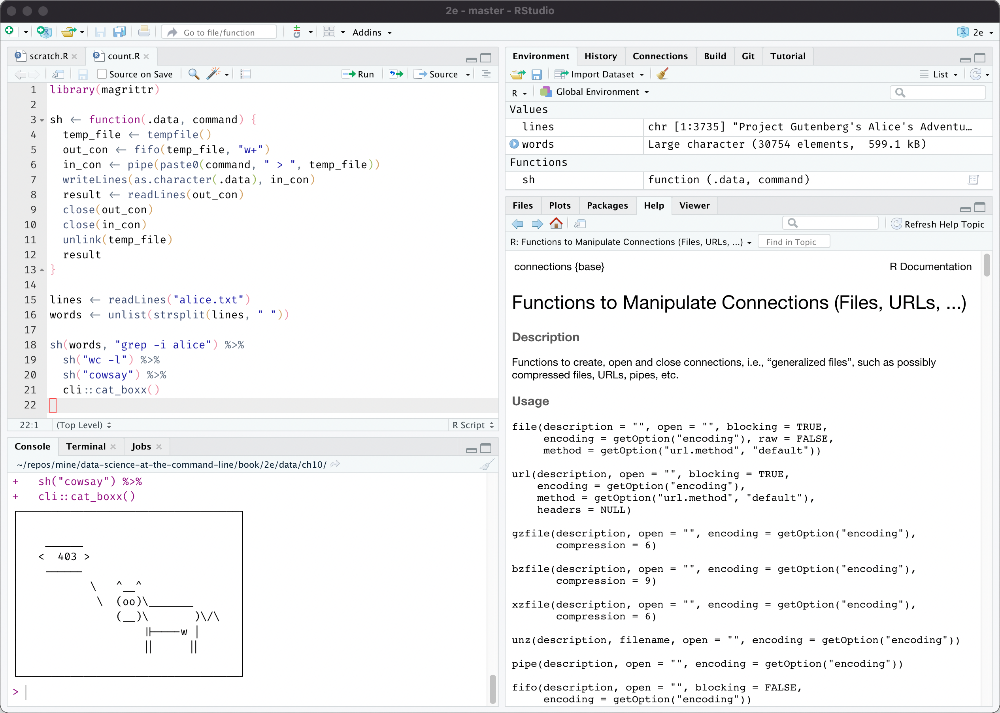
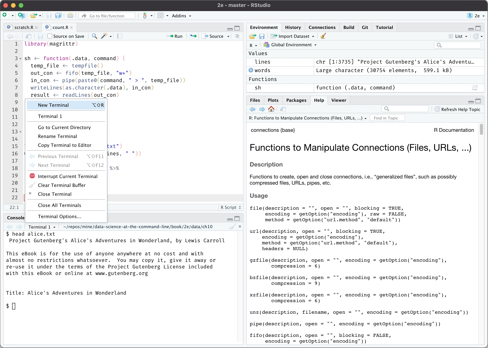

```{r console_start, include=FALSE}
console_start()
```

```{console setup_history, include=FALSE}
 export CHAPTER="10"
 export HISTFILE=/history/history_${CHAPTER}
 rm -f $HISTFILE
```


# Polyglot Data Science {#chapter-10-polyglot-data-science}

A polyglot is someone who speaks multiple languages.
A polyglot data scientist, as I see it, is someone who uses multiple programming languages, tools, and techniques to obtain, scrub, explore, and model data.

The command line stimulates a polyglot approach.
The command line doesn't care in which programming language a tool is written, as long as they adhere to the Unix philosophy.
We saw that very clearly in [Chapter 4](#chapter-4-creating-command-line-tools), where we created command-line tools in Bash, Python, and R.
Moreover, we executed SQL queries directly on CSV files and executed R expressions from the command line.
In short, we have already been doing polyglot data science without fully realizing it!

In this chapter I'm going take this further by flipping it around.
I'm going to show you how to leverage the command line from various programming languages and environments.
Because let's be honest, we're not going to spend our entire data science careers at the command line.
As for me, when I'm analyzing some data I often use the RStudio IDE and when I'm implementing something, I often use Python.
I use whatever helps me to get the job done.

I find it comforting to know that the command line is often within arm's reach, without having to switch to a different application.
It allows me to quickly run a command without switching to a separate application and break my workflow.
Examples are downloading files with `curl`, inspecting a piece of data with `head`, creating a backup with `git`, and compiling a website with `make`.
Generally speaking, tasks that normally require a lot of code or simply cannot be done at all without the command line.


## Overview

In this chapter, you’ll learn how to:

* Run a terminal within JupyterLab and RStudio IDE
* Interact with arbitrary command-line tools in Python and R
* Transform data using shell commands in Apache Spark

This chapter starts with the following files:

```{console}
cd /data/ch10
l
```

The instructions to get these files are in [Chapter 2](#chapter-2-getting-started).
Any other files are either downloaded or generated using command-line tools.

## Jupyter

Project Jupyter is an open-source project, born out of the IPython Project in 2014 as it evolved to support interactive data science and scientific computing across all programming languages.
Jupyter supports over 40 programming languages, including Python, R, Julia, and Scala.
In this section I'll focus on Python.

The project includes JupyterLab, Jupyter Notebook, and Jupyter Console.
I'll start with Jupyter Console, as it is the most basic one to work with Python in an interactive way.
Here's a Jupyter Console session illustrating a couple of ways to leverage the command line.

```{console remove=list(1, "1R"), callouts=c("date", "open", "int", "import", "curl", "rm -v", "upper")}
cat /data/.cache/jupyter-console#!expect_prompt=FALSE
C-C#!literal=FALSE
```
<1> You can run arbitrary shell commands and pipelines such as `date` or `pip` to install a Python package.
<2> Compare this line of Pyton code to count the number of lines in *alice.txt* with the invocation of `wc` below it.
<3> Note that standard output is returned as a list of strings, so in order to use the value of *total_lines*, get the first item and cast it to an integer.
<4> Compare this cell and the next to download a file with the invocation of `curl` below it.
<5> You can use Python variables as part of the shell command by using curly braces.
<6> If you want to use literal curly braces, type them twice.
<7> Using a Python variable as standard input can be done, but gets quite tricky as you can see.

Jupyter Notebook is, in essence, a browser-based version of Jupyter Console.
It supports the same ways to leverage the command line, including the exclamation mark and bash magic.
The biggest difference is that a notebook cannot only contain code, but also marked-up text, equations, and data visualizations.
It's very popular among data scientists for this reason.
Jupyter Notebook is a separate project and environment, but I'd like to use JupyterLab to work with notebooks, because it offers a more complete IDE.

Figure \@ref(fig:jupyterlab) is a screenshot of JupyterLab, showing the file explorer (left), a code editor (middle), a notebook (right), and a terminal (bottom). The latter three all show ways to leverage the command line.
The code is something I get back to in the next section.
This particular notebook is quite similar to the console session I just discussed.
The terminal offers a complete shell for you to run command line tools.
Be aware that there's no interactivity possible between this terminal, the code, and the notebook.
So this terminal is not really different from having a separate terminal application open, but it's still helpful when you're working inside a Docker container or on a remote server.

```{r jupyterlab, echo=FALSE, fig.cap="JupyterLab with the file explorer, a code editor, a notebook, and a terminal", fig.align="center"}

```


```{block2, type="rmdcaution"}
This notebook in the screenshot also contains a cell using so-called `%%bash` magic, which allows you to write multi-line Bash scripts.
Because it's much more difficult to use Python variables, I don't recommend this approach.
You're better off creating a Bash script in a separate file, and then executing it by using the exclamation mark (`!`).
```


## Python

The `subprocess` module allows you to run command-line tools from Python and connect to their standard input and output.
This module is recommended over the older `os.system()` function.
It's not run in a shell by default, but it's possible to change that with the `shell` argument to `run()` function.

```{console, callouts=c("run", "open", "split", "grep", "stdout")}
bat count.py
```
<1> The recommended way to leverage the command line is to use the `run()` function of the `subprocess` module.
<2> Open the file *filename*
<3> Split the entire text into words
<4> Run the command-line tool `grep`, where *words* is passed as standard input.
<5> The standard output is available as one long string. Here, I split it on each newline character to count the number of occurrences of *pattern*.

This command-line tools is used as follows:

```{console}
./count.py alice.txt alice
```

Notice that the first argument of the `run` call on line 15 is a list of strings, where the first item is the name of the command-line tool, and the remaining items are arguments.
This is different from passing a single string.
This is also means that you don't have any other shell syntax available that would allow for things such as redirection and piping.


## R

In R, there are several ways to leverage the command line.

In the example below, I start an R session and count the number of occurrences of the string *alice* in the book *Alice’s Adventures in Wonderland* using the `system2()` function.

```{r, include=FALSE}
# set_prompt(engine$session, prompts$R)
```

```{console, callouts=c("readLines", "strsplit", "system2", "length")}
R --quiet
lines <- readLines("alice.txt")
head(lines)
words <- unlist(strsplit(lines, " "))
head(words)
alice <- system2("grep", c("-i", "alice"), input = words, stdout = TRUE)
head(alice)
length(alice)
```
<1> Read in the file *alice.txt*
<2> Split the text into words
<3> Invoke the command-line tool `grep` to only keep the lines that match the string *alice*. The character vector *words* is passed as standard input.
<4> Count the number of elements in the character vector *alice*

A disadvantage of `system2()` is that it first writes the character vector to a file before passing it as standard input to the command-line tool.
This can be problematic when dealing with a lot of data and a lot of invocations.

It's better to use a named pipe, because then no data will be written to disk, which is much more efficient.
This can be done with `pipe()` and `fifo()` functions.
Thanks to Jim Hester for suggesting this.
The code below demonstrates this:

```{console callouts=c("fifo", "grep", "writeLines", "readLines", "close")}
out_con <- fifo("out", "w+")
in_con <- pipe("grep b > out")
writeLines(c("foo", "bar"), in_con)
readLines(out_con)
close(out_con); close(in_con); unlink("out")
```
<1> The function `fifo()` creates a special first-in-first-out file called *out*. This is just a reference to a pipe connection (like stdin and stdout are). No data is actually written to disk.
<2> The tool `grep` will only keep lines that contain a *b* and write them the named pipe *out* .
<3> Write two values to standard input of the shell command.
<4> Read the standard output produces by `grep` as a character vector.
<5> Clean up the connections and delete the special file.


<!-- check out the processx package https://processx.r-lib.org/. experimental at the time of writing. but seems very promising to working with connections in a more robust manner. -->


<!-- # all four options are executed in a shell.  -->
<!-- # no stdin and no stdout: system -->
<!-- # stdin but no stdout: writeLines(pipe) -->
<!-- # stdout but no stdin: readLines(pipe) -->
<!-- readLines(pipe("")) -->
<!-- # both stdin and stdout: fifo, readLines, writeLines -->
<!-- first-in first-out special file, named pipe -->
<!-- When processes are -->
<!-- exchanging data via the FIFO, the kernel passes all data -->
<!-- internally without writing it to the filesystem. -->


<!-- ## Leveraging the Command Line Elsewhere -->

<!-- ### Clipboard -->

<!-- yank -->
<!-- pbcopy pbpaste -->

<!-- when formatting emailadresses -->


Because this requires quite a bit of boilerplate code (creating connections, writing, reading, cleaning up), I have written a helper function `sh()`.
Using the pipe operator (`%>%`) from the `magrittr` package I chain together multiple shell commands.


```{console}
library(magrittr)

sh <- function(.data, command) {#! expect_prompt=FALSE
  temp_file <- tempfile()#! expect_prompt=FALSE
  out_con <- fifo(temp_file, "w+")#! expect_prompt=FALSE
  in_con <- pipe(paste0(command, " > ", temp_file))#! expect_prompt=FALSE
  writeLines(as.character(.data), in_con)#! expect_prompt=FALSE
  result <- readLines(out_con)#! expect_prompt=FALSE
  close(out_con)#! expect_prompt=FALSE
  close(in_con)#! expect_prompt=FALSE
  unlink(temp_file)#! expect_prompt=FALSE
  result#! expect_prompt=FALSE
}

lines <- readLines("alice.txt")
words <- unlist(strsplit(lines, " "))

sh(words, "grep -i alice") %>%#! expect_prompt=FALSE
  sh("wc -l") %>%#! expect_prompt=FALSE
  sh("cowsay") %>%#! expect_prompt=FALSE
  cli::cat_boxx()

q("no")#! expect_prompt=FALSE
```

```{r, include=FALSE}
# set_prompt(engine$session, prompts$bash)
```


## RStudio

The RStudio IDE is arguably the most popular environment for working with R.
When you open RStudio, you will first see the console tab:

```{r rstudio-console, echo=FALSE, fig.cap="RStudio IDE with console tab open", fig.align="center"}

```

The terminal tab is right next to the console tab.
If offers a complete shell:

```{r rstudio-terminal, echo=FALSE, fig.cap="RStudio IDE with terminal tab open", fig.align="center"}

```

Note that, just as with JupyterLab, this terminal is not connected to the console or any R scripts.


## Apache Spark

Apache Spark is a cluster-computing framework.
It's the 800-pound gorilla you turn to when it's impossible to fit your data in memory.
Spark itself is written in Scala, but you can also interact with it from Python using [PySpark](https://spark.apache.org/docs/latest/api/python/index.html) and from R using [SparkR](https://spark.apache.org/docs/latest/sparkr.html) or [sparklyr](https://spark.rstudio.com/).

Data processing and machine learning pipelines are defined through a series of transformations and one final action.
One such transformation is the `pipe()` transformation, which allows you to run the entire dataset through a shell command such as a Bash or Perl script.
The items in the dataset are written to standard input and the standard output is returned as an RDD of strings.

In the session below, I start a Spark shell and again count the number of occurrences of *alice* in the book *Alice’s Adventures in Wonderland*.

```{console, remove=list("alias", 2, 4, "cache"), callouts=c("textFile", "flatMap", "grep", "wc", "res3", "toInt", "res5")}
alias spark-shell=echo
spark-shell --master local[6]#!enter=FALSE
C-C#!literal=FALSE
cat /data/.cache/spark
```
<1> Read *alice.txt* such that each line is an element.
<2> Split each element on spaces. In other words, each line is split into words.
<3> Pipe each partition through `grep` to keep only the elements that match the string *alice*.
<4> Pipe each partition through `wc` to count the number of elements.
<5> There's one count for each partition.
<6> Sum all counts to get a final count. Note that elements first need to be converted from strings to integers.
<7> The above steps combined into a single command.

```{block2, type="rmdtip"}
The `pipe()` transformation is also available in PySpark, SparkR, and sparklyr.
```

<!-- https://stackoverflow.com/questions/54239583/question-about-rdd-pipe-operator-on-apache-spark -->

If you want to use a custom command-line tool in your pipeline, then you need to make sure that it's present on all nodes in the cluster (known as the executors).
One way to do this is to specify the filename(s) with the `--files` option when you're submitting Spark applications using `spark-submit`.

Matei Zaharia and Bill Chambers (the original author of Apache Spark) mention in their book *Spark: The Definitive Guide* that "[t]he `pipe` method is probably one of Spark's more interesting methods."
That's quite the compliment!
I think it's fantastic that the developers of Apache Spark added the ability to leverage a 50-year old technology.


<!-- ### Notable mentions -->

<!-- - Julia: Blog post with an introduction: https://blog.leahhanson.us/post/julia/julia-commands.html -->
<!-- - Visual Studio Code https://code.visualstudio.com/docs/editor/integrated-terminal -->
<!-- - Emacs -->
<!-- - VIM (using ! command) -->
<!-- - OS: Guake, -->
<!-- - OS: iTerm2:    https://www.sharmaprakash.com.np/guake-like-dropdown-terminal-in-mac/ -->
<!-- https://github.com/shelljs/shelljs -->
<!-- https://amoffat.github.io/sh/ -->
<!-- https://plumbum.readthedocs.io/en/latest/ -->
<!-- <\!-- ## Other Combinations -\-> -->

<!-- - reticulate -->
<!-- - Rpy2 -->
<!-- - sparkr -->
<!-- - sparklyr -->


<!-- TODO: MUST: Write Summary or Conclusion -->
<!-- # Summary -->
<!-- TODO: MUST: Talk about other combinations between languages. This is already possible with this approah, but there are tighter integrations. -->

## Summary

In this chapter you learned several ways to leverage the command line in other situations, including programming languages and other environments.
It's important to realize that the command line doesn't exist in a vacuum.
What matters most is that you use tools, sometimes in combination, that reliably get the job done.

Now that we've had all the four OSEMN chapters and the four intermezzo chapters, it's time to wrap this up and conclude in the final chapter.


## For Further Exploration

- There are also ways to integrating two programming languages directly, without the use of the command line. For example the [`reticulate` package](https://rstudio.github.io/reticulate/) in R allows you to interface with Python directly.
